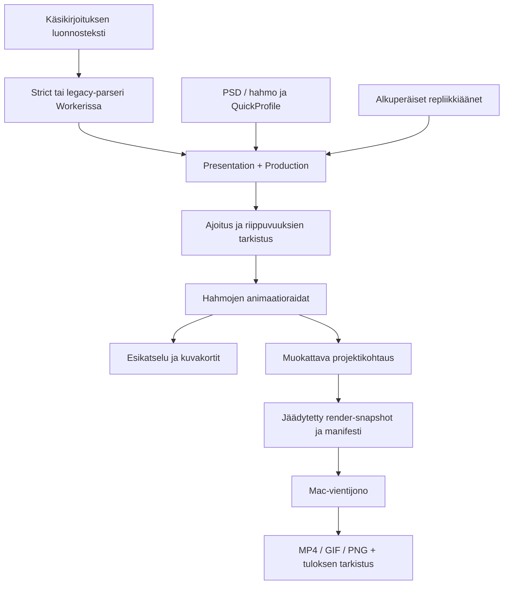
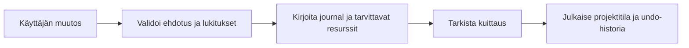

# KILSAT Studio / Hahmostudio — kattava perehdytys Cursorille

**Päiväys:** 5.10.2026. **Dokumentoitu sovellus:** 0.36.0. **Kieli:** suomi.

Tämä tiedosto on nykyisen sovelluksen tekninen ja toiminnallinen luovutusdokumentti. Se auttaa Cursorissa työskentelevää kehittäjää ymmärtämään tuotteen, avaamaan oikean projektin, löytämään toteutukset ja testit sekä jatkamaan työtä rikkomatta käyttäjän projekteja. Tämä ei ole uuden sovelluksen rakennuspyyntö eikä todiste koko tuotteen tuotantovalmiudesta.

## 0. Lue tämä ensin

- Tuotteen näkyvä nimi on **KILSAT Studio**. Repositorion ja npm-paketin nimi on edelleen **hahmostudio**. Älä vaihda paketin nimeä, bundle ID:tä, käyttäjädatan sijaintia tai tallennusmuotoja pelkän nimiyhtenäisyyden vuoksi.
- Käyttäjä on kehittänyt sovellusta pitkään. Säilytä nykyiset ominaisuudet, hahmot, taustat, rekvisiitta, käsikirjoitukset, projektit, äänet, animaatiot ja vanhojen tiedostojen avaaminen.
- React/TypeScript-editori ja Electron-versio ovat samaa sovellusperhettä. Älä aloita projektia alusta äläkä korvaa toimivaa animaatio-, PSD-, renderöinti- tai käsikirjoitusmoottoria käyttöliittymämuutoksessa.
- Ratkaisujen tulee olla ensisijaisesti paikallisia ja sääntöpohjaisia. Älä lisää pilvipalvelua, ML-mallia, TTS-palvelua tai uutta backendia ilman erillistä tarvetta.
- Käyttäjän pitää voida tarkistaa ja ohittaa automaattiset valinnat. Tuntemattomasta olennaisesta käsikirjoitusohjeesta pitää tulla näkyvä ilmoitus.
- Älä väitä ominaisuutta valmiiksi, jos siinä on vain malli, käyttöliittymä tai simuloitu testi.
- Lue aina projektin [AGENTS.md](AGENTS.md). Tässä dokumentissa kuvataan myös historiallisia ohjeita korvaavia nykyisiä toteutuksia; ristiriitatilanteessa tarkista nykyinen koodi ja käyttäjän viimeisin pyyntö.
- Kerro käyttäjälle jokaisessa jatkokehityksen toimituksessa nykyinen kehitysvaihe, mitä valmistui, testaus ja jäljellä olevat puutteet.

### 0.1 Mitä tässä dokumentissa tarkoitetaan eri tiloilla?

| Merkintä | Merkitys |
| --- | --- |
| Toteutettu | Lähdekoodissa on käytettävä toimintopolku; tämä ei yksin todista käytännön toimivuutta kaikissa ympäristöissä. |
| Kooditestattu | Automaattinen domain-, tiedosto-, palvelin-, markup- tai simulaatiotesti tarkistaa rajatun asian. |
| Paketissa tarkistettu | Rakennus, arkisto, allekirjoitus tai paketoidun Electronin Node-runtime on tarkistettu. |
| Varmistamatta | Todellista GUI-, laite-, suorituskyky- tai toisen koneen hyväksyntää ei ole saatu. |
| Osittainen | Toiminto toimii rajatuilla malleilla/resursseilla, mutta laajempi tavoite puuttuu. |
| Suositus | Uusi ehdotus; älä käsittele nykyisenä ominaisuutena. |

## 1. Lähteet, versio ja dokumentoinnin luotettavuus

Perehdytys perustuu paikallisen 0.36.0-lähdepuun lukemiseen: package.json, AGENTS.md, SOVELLUSKUVAUS.md, kehitysmuistiot 0.31–0.36, mallien ja palveluiden toteutukset, testit sekä aiemmat toimitusraportit. Tarkistettuja tiedostoja linkitetään asian kohdalla. Uuden dokumentin vuoksi ei ajettu koko sovelluksen testisarjaa uudestaan eikä muutettu sovelluksen koodia.

Viimeisin tässä keskustelussa toimitettu lähdekoodicommit oli `307e19a0ebd67f2d4fc6ab834aadd7a1c0b8dc99`, versio 0.36.0. Tätä tunnistetta ei saatu tässä dokumentointiajossa paikallisella `git rev-parse` -komennolla: käytössä oleva `work/hahmostudio` on lähdepeili ilman `.git`-hakemistoa. Cursorin oikeassa Git-checkoutissa tarkista HEAD ja etähaaran tila ennen muutoksia. Älä oleta, että muistiossa mainittu commit on ikuisesti uusin.

**Tärkeä dokumentointiriski:** [SOVELLUSKUVAUS.md](SOVELLUSKUVAUS.md) sisältää vanhan 0.10-kuvauksen ja päivityksiä sen ympärillä. Monet yksittäiset väitteet ovat historiallisia. [docs/DESIGN_SYSTEM.md](docs/DESIGN_SYSTEM.md) kuvaa vanhempaa sinistä suunnittelusuuntaa; nykyiset tokenit ovat oransseja. [docs/grammar-coverage.json](docs/grammar-coverage.json) on vanha suomenkielisen liikeperheen raportti. Älä päättele nykytilaa yhden vanhan kappaleen perusteella.

Ensisijainen lukujärjestys:

1. Tämä dokumentti ja AGENTS.md.
2. package.json, README.md, DEVELOPMENT-0.36.md.
3. Muutettavan toiminnon nykyinen koodi ja sen testit.
4. DEVELOPMENT-0.31.md tallennukseen, 0.32 toistoon, 0.34 kamera/ääni-ajoitukseen, 0.35 sijaintiin/UI:hin.
5. Vanhemmat muistiot taustatiedoksi.

## 2. Käyttötarkoitus ja käyttäjän tavoite

Sovellus on paikallinen suomenkielinen hahmoanimaation editori. Käyttäjä haluaa tehdä omilla hahmoilla nopeita dialogi- ja leikkausanimaatioita, ensisijaisesti **1080 × 1920** Instagram/TikTok-pystyvideoita. Useita jaksoja voidaan koota YouTubeen laajakuvaesitykseksi. Muita näyttämömuotoja ovat **1920 × 1080** ja **1080 × 1080**.

Tavoiteltu tuotantopolku:

```text
käsikirjoitus → ohjaussuunnitelma → hahmot ja repliikkiäänet
→ kohtaukset ja kuvat → animaatio ja suuajoitus
→ tarkistus ja hyväksyntä → jäädytetty render → valmis video
```

Sovellus palvelee nykyisellään erityisesti yhtä käyttäjää. Tiimin tuotantopalvelu, täysi kausihierarkia, ammattimainen äänimikseri ja masterointi ovat jatkotavoitteita. Nykyinen paikallinen omistaja-/vastuuteksti ei ole monen käyttäjän identiteetti.

Tyylisuunta on oma kartonki-/leikkausanimaatio: isot päät, selkeät väripinnat ja tarkoitukselliset liikkeet. South Park on ollut tyylillinen viite. Älä kopioi sen hahmoja, väitä tuotetta Adobe Character Animatorin täydelliseksi vastineeksi tai sekoita paperikerrosten 2.5D-projektiota tilavuudelliseen 3D:hen.

Sovellus ei julkaise videoita sosiaaliseen mediaan automaattisesti. Valmis video viedään tiedostoksi.

## 3. Kehityksen nykyvaihe lyhyesti

| Kokonaisuus | Nykytila | Olennainen rajaus |
| --- | --- | --- |
| PSD/PNG-tuonti ja tasot | Toteutettu | Rajattu PSD-tuki, ei Photoshopin koko formaattia. |
| Piirto ja yksinkertaiset vektorit | Toteutettu | Rasteroitu viiva ei muutu vektoriviivaksi. |
| Rig, parentKey ja muunnokset | Toteutettu | Tarvitaan oikeat roolit/pivotit; kuvasta ei synny automaattisesti anatomiaa. |
| Aikajana/avainruudut/easing | Toteutettu | 10 000 avainruudun raja; ei täysi DCC-animaatiojärjestelmä. |
| Hahmo/Esitys/Animointi | Toteutettu | Sama projekti, ei kolme erillistä moottoria. |
| Oma käsikirjoitussivu | Toteutettu 0.36 | Käytännön GUI-varmennus tässä versiossa puuttuu. |
| Suomen/englannin strict-kieli | Toteutettu | Rajattu, eksplisiittinen kielioppi; ei vapaan proosan täydellistä tulkintaa. |
| Kamera, mikrofoni, näppäimet | Toteutettu ja simulaatioita testattu | Fyysisen laitteen ja laitekohtaisen synkan hyväksyntä puuttuu. |
| Puheäänet | Tuonti ja oma äänitys | Teksti ei itsestään tuota puheääntä. |
| Rhubarb/Whisper | Paikalliset työkalut | Suumuodot ja litterointi ovat eri toimintoja. |
| Shot Board/review/vastuut/CSV | Toteutettu paikallisesti | Ei verkotettua tiimityönkulkua. |
| Komentojen kuittaus ja delta-WAL | Toteutettu Mac-polussa | Baseline, legacy ja selainfallback ovat erillisiä. |
| Undo/redo ja siirrettävä historia | Toteutettu, rajattu | Max 16 historiaviitettä, 128 MiB paketti. |
| 2D-ketjujen liikesovitus | Toteutettu rajatusti | Ei mielivaltaisen 3D-anatomian automaattista retargetia. |
| MP4/GIF/PNG ja Mac-vientijono | Toteutettu | Ei EXR/ProRes/LUFS-masterointia. |
| 60 fps kaikilla aineistoilla | Ei osoitettu | Historiallinen todellinen mittaus jäi tavoitteen alle. |
| Puhdas toinen Mac / GUI | Varmistamatta | Paketin Node-smoke ei ole graafinen käynnistys. |

## 4. Projektin ja toimitusten sijainnit

Tämän käyttäjän työtilassa:

```text
/Users/Aleksi/Documents/Codex/2026-10-02/vie/
  work/hahmostudio/            lähdepeili, nykyinen dokumentointikohde
  outputs/Hahmostudio/         toimituksen lähdepuu
  outputs/Esimerkit/           käyttäjän säilytettävät esimerkkiprojektit/media
  outputs/Hahmostudio-Mac-0.36.0-arm64.zip
  outputs/Hahmostudio-lahdekoodi-0.36.0.zip
  outputs/Kooditestit-0.36.0.md
  scripts/siivoa-outputs.py     toimitusten siivous
```

Asennettu tämän version erillinen sovellus:

```text
/Users/Aleksi/Applications/KILSAT Studio 0.36.app
```

Aiemmassa työssä käytetty `/private/tmp/kilsat-033` oli tilapäinen Git/build-työpuu. **Sitä ei löytynyt tämän dokumentointiajon alussa.** Älä käytä sitä pysyvänä lähdehakemistona tai kovakoodaa polkua skriptiin.

Repositorio: `aleksipii/hahmostudio`. Repositorion julkisuus/yksityisyys ei todista verkkosovelluksen pääsynhallintaa. Dokumentointi ei ota kantaa repositorion tämänhetkiseen näkyvyyteen.

Cursorissa avaa varsinainen repositorion juuri, jossa ovat `package.json`, `components`, `lib`, `desktop` ja `AGENTS.md`. Jos tarvitset Git-toimintoja, käytä oikeaa checkoutia; lähdekoodi-ZIP ja paikallinen lähdepeili eivät itsessään sisällä Git-historiaa.

## 5. Teknologiat, versiot ja riippuvuudet

Lähde: [package.json](package.json), [tsconfig.json](tsconfig.json), [vite.config.ts](vite.config.ts).

| Teknologia | Versio package.jsonissa | Tehtävä |
| --- | --- | --- |
| TypeScript | 5.9.3 | Strict-tyyppitarkistus. |
| React / React DOM | 19.2.6 | Jaettu editori ja portalit. |
| Vite | ^8.3.2 | Kehityspalvelin, Workerit ja build. |
| @vitejs/plugin-react | 6.0.2 | React-buildin integraatio. |
| Electron | 44.5.1 | Macin pääprosessi, selainikkuna ja rajattu IPC. |
| @electron/packager | 20.3.0 | Mac-sovelluspaketti. |
| ag-psd | 31.0.2 | PSD-lukeminen ja kehitysskriptien PSD-kirjoitus. |
| fflate | 0.8.3 | Projekti- ja historia-arkistot. |
| @mediapipe/tasks-vision | ^0.10.32 | Kameran kasvopisteet. |
| mediabunny | ^1.61.0 | Media-/web-vientipolun työkaluja. |
| lucide-react | 1.31.0 | Käyttöliittymäkuvakkeet. |
| Node.js | >=22.13.0 | Testit, build ja palvelimet. |

Projektissa on ES-moduulit (`type: module`). TypeScriptissa ovat `strict: true`, `noEmit: true`, `moduleResolution: Bundler`, `react-jsx`, DOM- ja ES2022-kirjastot. Node-testit käyttävät `--experimental-strip-types`-ominaisuutta.

Natiiviresurssit: paikallinen Rhubarb, FFmpeg/FFprobe, whisper.cpp ja mallidata. Niiden lisenssit ja lähdeilmoitukset ovat erillisiä npm-riippuvuuksista. Kuvien uudelleengenerointi voi vaatia Python/Pillow- ja Sharp-kehitystyökaluja. Näitä ei saa sekoittaa tavallisen käyttäjän runtime-vaatimuksiin.

## 6. Komennot ja käytännön käynnistys

Aja komennot repositorion juuressa.

```sh
npm ci
npm run typecheck
npm test
npm run dev
```

Yksityinen web-versio:

```sh
npm run build:private
npm run start:private
```

Electron:

```sh
npm run desktop:dev
npm run desktop:build
npm run desktop:package:mac
npm run desktop:test:package
```

Lisäkomennot:

```sh
npm run desktop:test
npm run benchmark
npm run grammar:coverage
npm run grammar:coverage -- --verify
npm run grammar:coverage -- --list
```

- `grammar:coverage` kirjoittaa raportin `docs/grammar-coverage.json`-tiedostoon. `--verify` jäsentää generoidut lauseet ja lisää mittarit. `--list` kirjoittaa suuren listan väliaikaistiedostoon; se ei ole normaali käyttövaihe.
- `benchmark` tekee domain-, serialisointi- ja levypolun mittauksia; se ei ole GPU-/GUI-fps-testi.
- Mac-paketointi edellyttää Macia, oikean arkkitehtuurin natiiviresursseja ja vision-aineistoja. `npm ci` ei yksin valmistele niitä kaikkia.
- Käytä package-lock.jsonia. Älä tee samalla riippuvuuksien laajaa päivitystä, jos tehtävä koskee yhtä toimintoa.
- Projektissa ei ole erillistä lint-komentoa. Älä ilmoita lintin läpäisseen tai lisää työkalua vain raportin vuoksi.
- Jos `npm test` epäonnistuu `listen EPERM 127.0.0.1` -virheeseen, ympäristön loopback-rajoitus voi estää palvelintestin. Raportoi se testin estymisenä, älä sovelluksen testien onnistumisena.

## 7. Tiedostokartta ja vastuurajat

```text
components/                  React-käyttöliittymä
lib/                         domain, mallien validointi, animaatio ja renderöinti
lib/studio/                  tuotanto, komennot, tallennus, historia, review
lib/cutout/                  erilliset sääntöpohjaiset kartonki/SVG-moduulit
server/                      yksityinen paikallinen palvelin ja puhetyökalut
desktop/                     Electron, turvallinen tiedosto/IPC ja vientijono
public/library/              hahmot, PSD:t, taustat ja rekvisiitta
public/vision/               vision-mallin/wasmin paikalliset build-resurssit
public/branding/             logo
styles/                      tokenit ja app-shell-tyylit
style.css, studio-ui.css      aiemmat ja täydentävät tyylit
scripts/                     build, paketointi, benchmark ja aineistogeneraattorit
licenses/                    lisenssiaineistot
tests/fixtures/              pitkien käsikirjoitusten odotetut tulokset
docs/                        arkkitehtuuri, ohjeet ja mittausraportit
```

### 7.1 Käyttöliittymän tärkeät komponentit

| Tiedosto | Vastuu |
| --- | --- |
| [components/editor.tsx](components/editor.tsx) | Projektin ja editorin integraatio, työtilat, pysyvät komennot, historia, render, laitteet, avaaminen/tallennus. |
| [components/presentation-panel.tsx](components/presentation-panel.tsx) | Käsikirjoitus, cast/äänet, ohjausmuutokset, valmistelu ja rakentaminen. |
| [components/production-board.tsx](components/production-board.tsx) | Tuotannon näkymien yhdistäminen nykyiseen esitysmalliin. |
| [components/studio-shot-board.tsx](components/studio-shot-board.tsx) | Kuvakortit, valinta ja tuotantotietojen käyttö. |
| [components/production-dashboard.tsx](components/production-dashboard.tsx) | Paikallinen tuotantotilanteen koonti. |
| [components/production-validation-panel.tsx](components/production-validation-panel.tsx) | Ongelmahaku ja tarkistuskohteeseen navigointi. |
| [components/animation-panel.tsx](components/animation-panel.tsx) | Raidat, avainruudut, aikajanazoom ja asetukset. |
| [components/presentation-timeline.tsx](components/presentation-timeline.tsx) | Tuotantotapahtumat ja yhteinen toistokohta. |
| [components/easing-editor.tsx](components/easing-editor.tsx) | Bézier-esikatselu, presetit ja CP1/CP2-kahvat. |
| [components/state-editor.tsx](components/state-editor.tsx) | Hahmon liikelogiikan tilakaavion muokkaus. |
| [components/panel-dock.tsx](components/panel-dock.tsx) | Pysyvä portal-isäntä; siirto ilman controllerien remountia. |
| [components/panel-resizer.tsx](components/panel-resizer.tsx) | Paneelin Pointer-/näppäimistömitoitus. |
| [components/camera-panel.tsx](components/camera-panel.tsx), [quick-panel.tsx](components/quick-panel.tsx) | Kamera ja yhdistetty live-/ääniohjaus. |
| [components/dialogue-recorder.tsx](components/dialogue-recorder.tsx) | Repliikin paikallinen tallennus ja liittäminen. |
| [components/layer-editor.tsx](components/layer-editor.tsx), [rig-panel.tsx](components/rig-panel.tsx) | Piirtäminen ja nivelmääritys. |
| [components/stage-position.tsx](components/stage-position.tsx), [production-position.tsx](components/production-position.tsx) | Näyttämöllä raahaaminen ja rajattu tuotantohahmon sijoittelu. |
| [components/import-review.tsx](components/import-review.tsx), [export-panel.tsx](components/export-panel.tsx) | Tuonnin tarkistus ja todellinen vientijono. |
| [components/relink-mapping-panel.tsx](components/relink-mapping-panel.tsx) | Resurssin/tasojen ja ketjusovituksen tarkistettava mapping. |

Tiedostojen rivimäärät johtavat helposti harhaan: editor.tsx sisältää erittäin pitkiä rivejä ja paljon kytkentöjä; lyhyt JSX-rivimäärä ei tarkoita pientä vastuuta. Integraatiomonoliittien pilkkominen on jatkotyötä, mutta vain toiminnallisuuden ja testien säilyessä.

### 7.2 Domainin tärkeät polut

| Ryhmä | Tiedostot |
| --- | --- |
| Dokumentti/tuonti | `psd-model.ts`, `psd-import.ts`, `psd.worker.ts`, `png-import.ts`, `character-import.ts` |
| Rig ja pose | `rig-model.ts`, `animation-model.ts`, `animation-transform.ts` |
| Liikkeet | `inverse-kinematics.ts`, `locomotion.ts`, `walk-animation.ts`, `screenplay.ts`, `presentation-motion.ts` |
| Esitysmalli | `presentation-model.ts`, `production-model.ts`, `presentation-stage.ts` |
| Parserit | `script-grammar.ts`, `presentation-parser.ts`, `production-job.ts`, `production-worker.ts` |
| Ajoitus/koostaminen | `presentation-timing.ts`, `presentation-compile.ts`, `presentation-append.ts` |
| Render | `psd-render.ts`, `scene-render.ts`, `presentation-render.ts`, `export-render.ts`, `toon-render.ts` |
| Kamera/live | `face-motion.ts`, `performance-mixer.ts`, `quick-animation.ts`, `capture-clock.ts` |
| Ääni | `microphone.ts`, `browser-audio.ts`, `presentation-audio.ts`, `phonetic-speech.ts`, `audio-analysis.ts` |
| Näyttämö/rajat | `scene-model.ts`, `stage-bounds.ts`, `stage-production.ts`, `scene-resize.ts`, `composition.ts` |
| Projekti/vienti | `project-file.ts`, `platform.ts`, `export-presets.ts`, `video-export.ts`, `mp4-export.ts`, `animation-export.ts` |

## 8. Arkkitehtuuri ja datavirta



Muokkaus kulkee erikseen turvallisen komentorajan läpi:



UI:n luonnos voi näkyä ennen pysyvää tallennusta esimerkiksi tekstikentässä tai raahauksen esikatselussa. Se ei ole vielä vahvistettu projektimuutos. Älä sekoita väliaikaista palautettavaa previewta pysyvän projektin ennen-kuittausta julkaisemiseen.

## 9. Tietomallit ja yhteinen aika

### 9.1 Nykyiset auktoritatiiviset mallit

- `PsdDocument`: nimi, kuvan koko, tasot, varoitukset, alkuperäinen PSD/composite, QuickProfile ja esityksen resurssit.
- `LayerNode`: key, PSD-ID, nimi/polku, taso/ryhmä, mitat/offsetit, näkyvyys, peittävyys, sekoitustila, kuvat ja paikalliset muokkaukset.
- `Rig`: lähdedokumentti ja osat. `RigPart`: role, pivot, joints, optional parentKey.
- `Animation`: format/version, fps, duration ruutuina, rig, tracks ja optional stateMachine.
- `Pose`: x/y, rotation, scale ja opacity. Keyframe lisää frame, easing ja optional bezierCurve.
- `QuickProfile`: semanttiset roolisidokset, näppäimet, live-asetukset, optional views/switchDefaults/cameraOffsetMs.
- `Scene`: videon mitat, tausta, x/y/scale, apuviivat, puhelin, leikkaukset, valmistelu ja rakennetut presentations.
- `Presentation`: puheen/ohjauksen/kuvien yhteinen malli, puhujat, tapahtumat, cast, ääniklippiviitteet, diagnostiikka ja hahmoanimaatiot.
- `Production`: nykyisen esitysmallin tuotantolaajennus; lähdeviitteet, revisiot, kamerat, profiilit, ohitukset ja lukitukset.
- `StudioMetadata`: pysyvät tuotanto-ID:t, revisio, review, tasks ja hyväksyntätiedot.

### 9.2 Domain-adapteri

[lib/studio/domain.ts](lib/studio/domain.ts) muodostaa nykyisestä esityksestä `Episode`, `ProductionScene` ja `Shot`-projektiot. **Presentation/Production pysyvät animaation totuuslähteenä.** Älä tee Shot Boardin React-tilasta toista riippumatonta animaatiomallia.

Aikakanta on **35 280 000 tickiä sekunnissa**. `ticks(seconds)` ja `seconds(ticks)` validoivat kokonaislukuarvot. Esityksen tapahtumat käyttävät sekunteja; animaatiokanavat käyttävät ruutuja; adapterin tuotantokohteet tickejä. Render/toisto voi näytteistää murto-osaruutua.

```ts
// Nykyisen mallin keskeinen rakenne; lue täydellinen tyyppi domain.ts:stä.
type ShotStatus = 'draft' | 'approved' | 'locked';

type Episode = {
  id: string;
  name: string;
  revision: number;
  timebase: 35_280_000;
  duration: number;
  scenes: ProductionScene[];
  shots: Shot[];
};
```

Täysi `Series → Season → Episode → Sequence → Scene → Shot` -hierarkia ei vielä ole yleinen, erikseen versionoitu tuotantodomain. Sarjapaketointi ja episode-ajattelu eivät ole sama asia kuin koko tuotantohierarkian valmistuminen.

### 9.3 Tilan omistajuus

Nykyisin editori omistaa suuren osan React-projektitilasta ja refs-/history-palveluista. Tuotantomuutokset kulkevat yhteisten komentofunktioiden läpi. UI-asetukset ovat localStorage-/Electron-preferences-tilaa. Playhead, laitehavainto ja väliaikainen pose eivät ole samaa asiaa kuin tallennettu projekti.

Uuden ominaisuuden tulee erottaa:

1. tallentuva domain-data;
2. johdettu data ja validointi;
3. muokkauksen luonnos/preview;
4. layout ja valinta;
5. ulkoiset resurssit ja natiivipalvelut.

Ehdotettu ProjectStore/SelectionStore/LayoutStore-arkkitehtuuri ei ole vielä kokonaan toteutettu. Älä kuvaa sitä nykyiseksi rakenteeksi äläkä kopioi koko projektia yhteen uuteen React Contextiin.

## 10. Käyttöliittymä ja design system

Kolme editorityötilaa ovat Hahmo, Esitys ja Animointi. Versio 0.36 lisää niiden päälle oman käsikirjoitussivun, ei uutta tallennusformaattia tai korvaavaa animaatiomoottoria.

- Yläpalkissa ovat työtilat, Tiedosto/Muokkaa/Näytä/Asetukset/Ohje, tärkeät toimintonapit ja logo.
- Vasemmalla kirjasto, tasot, käsikirjoitus ja jaksot/sarja.
- Keskellä näyttämö ja tuotannon esikatselu/kuvakortit.
- Oikealla valinta, näyttämö, liikkeet tai ohjaus.
- Alhaalla aikajana, toisto ja todellisten laitteiden tilarivi.
- Paneelien mitat/näkyvyys, ikkunan sijainti ja accordion-asetuksia tallennetaan paikallisesti.
- Portal-isännän siirtäminen pitää laitekomponentit mounted-tilassa. Kameraa ei saa sammuttaa vaihtamalla työtilaa tai piilottamalla paneelia.

Nykyiset värit ja pinnat ovat [styles/tokens.css](styles/tokens.css) ja [styles/app-shell.css](styles/app-shell.css). Korostusväri on **oranssi #DF8E15**, perusteksti on kompakti, järjestelmäkirjasin Macissa. Säilytä vaalea/tumma/järjestelmän teema sekä vähennetyn liikkeen/läpinäkyvyyden asetukset.

Aiemmat `style.css` ja `studio-ui.css` ovat edelleen mukana. CSS ei ole kokonaan yksi valmis design system. Uusissa komponenteissa käytä todellisia semanttisia tokeneita, kuten `--color-bg`, `--color-surface`, `--color-border`, `--color-text`, `--color-accent` ja käytettävissä olevia radius/spacing-tokeneita. Älä keksi olematonta `--bg`- tai `--surface`-tokenia.

Natiivi oletusikkuna 1440×900, minimi 1200×700. Sivupaneelit on jaettu/resizable, aikajanalla on minimikorkeus. Pienet ikkunat ja Retina vaativat yhä todellisen tarkistuksen. Ei täydellistä kelluvaa Photoshop-tyyppistä dock-järjestelmää tai viittä ammattityötilapresetiä.

### 10.1 Saavutettavuus

Nykyiset toteutukset: labels, aria-pressed, status/alert-tekstit, näppäimistöerottimet, valikkonavigointi, fokus ja testattuja kontrasteja. Nämä eivät ole koko tuotteen WCAG-auditointi.

Jatkossa varmista erityisesti:

- käsikirjoitussivun fokuksen siirtyminen ja taustalla olevan editorin poistuminen Tab-järjestyksestä;
- kompakti 12 px typografia, suurennettu teksti ja osumakoot;
- näkyvien virheiden ja palautuspisteen toimintonappien löytyminen;
- pitkässä paneelissa selkeät vaiheotsikot ja sisäinen vieritys;
- toiminnon disabled-tilan syy;
- väriä täydentävät teksti/ikonit ja ruudunlukijat;
- Cmd-oikoteet eivät käynnistä live-liikkeitä tekstin kirjoittamisen aikana.

## 11. Oma käsikirjoitussivu ja 0.36-korjaus

[components/editor.tsx](components/editor.tsx) käyttää `scriptPage`-näkymätilaa ja siirtää olemassa olevan käsikirjoitusworkflow'n PanelDockilla leveälle sivulle. PresentationPanel ei saa remountata sivun vaihdossa.

Korjattu ongelma: ensimmäinen tekstin tallennus tyhjässä editorissa loi `Tuotanto`-dokumentin. Vanha komponentin key käytti dokumentin nimeä ja projektin generationia, joten nimen vaihtuminen käynnisti paneelin uudelleen. Nyt key riippuu projektin generationista. Uuden varsinaisen projektin avaus saa edelleen palauttaa projektikohtaisen tilan.

Lähdetekstin luonnos, sen pysyvä tallennus, tunnistettu esitysmalli ja rakennettu jakso ovat eri vaiheita. Säilytä nämä erot näkyvinä. Älä poista käyttäjän tekstiä, jos parseri epäonnistuu tai journal ei kuittaa.

Workflow:n vaihelinkit:

1. teksti;
2. ohjaus;
3. hahmot;
4. äänet;
5. tarkistus ja rakentaminen.

GUI-käytön todentaminen ja focus/layout-rajojen hyväksyntä puuttuvat tässä versiossa. Koodissa oleva korjaus ei ole todiste kaikkien käyttäjän raportoimien käyttöliittymäongelmien poistumisesta.

## 12. Käsikirjoituskielet ja parserit

Sovelluksessa on useita toisiaan täydentäviä polkuja. Niitä ei saa sekoittaa.

| Polku | Käyttö | Toteutus |
| --- | --- | --- |
| Strict `#!kilsat` | Rajattu suomi/englanti, täsmälliset kestot ja virheet | `script-grammar.ts` → `presentation-parser.ts` |
| Legacy-tuotantokieli | Laajemmat tuetut ohjausrakenteet, enemmän tulkinta-arvioita | `presentation-parser.ts`, `presentation-direction.ts`, `production-model.ts` |
| Vanha yhden hahmon liikeohje | Hakasulkujen liike-/taustaohjeet | `screenplay.ts`, ScriptPanel |
| Kartonki/SVG-kieli | Erillinen deterministic cutout-malli | `lib/cutout/parser.ts` ja muut cutout-moduulit |

### 12.1 Strict-kielen nykyinen sanasto

Aloita `#!kilsat`. Ilmoita hahmot ja tapahtumien kestot. Parserin nykyiset suorat säännöt:

| Suomen muoto | Englannin muoto | Komento |
| --- | --- | --- |
| `Hahmo: Kille` | `Character: Kille` | Hahmomääritys. |
| `Kohtaus: Studio` | `Scene: Studio` | Kohtausotsikko. |
| `Kille kävelee oikealle 2 s` | `Kille walks right 2 seconds` | Walk-right. |
| `Kille juoksee vasemmalle 2 s` | `Kille runs left 2 seconds` | Run-left. |
| `Kille kävelee suoraan 2 s` | `Kille walks forward 2 seconds` | Walk-front. |
| `vilkuttaa / nyökkää / hyppää / kyykistyy` | `waves / nods / jumps / crouches` | Nimetty ele/liike, kesto perässä. |
| `Kille sanoo: "Hei" 2 s` | `Kille says: "Hello" 2 seconds` | Repliikki; teksti ei muutu ääneksi. |
| `Kamera: lähikuva Kille 1 s` | `Camera: close-up Kille 1 second` | Close; tarvitsee nimetyn kohteen. |
| `Kamera: puolikuva Kille 1 s` | `Camera: medium Kille 1 second` | Medium. |
| `Kamera: laaja 1 s` | `Camera: wide 1 second` | Wide. |
| `Kille ilme: huolestunut 1 s` | `Kille expression: worried 1 second` | Ilme. |
| `hämmentynyt / loukkaantunut / kulmakarvat ylös` | `confused / hurt / eyebrows raised` | Muut nykyiset ilmesäännöt. |
| `Kille katsoo: Handu 1 s` | `Kille looks at: Handu 1 second` | Katse toiseen hahmoon. |
| `Kille katsoo: puhelin 1 s` | `Kille looks at: phone 1 second` | Puhelin. |
| `Tausta: studio 1 s` | `Background: studio 1 second` | Studio-ympäristö. |
| `olohuone / kaupunki ilta / auto moderni` | `living room / city evening / modern car` | Muut strict-ympäristöt. |
| `Kille puhelin: esille / pois / edestä / takaa / sivulta` | `Kille phone: show / hide / front / back / side` | Puhelimen näkyvyys/kulma, kesto perässä. |
| `Odota 1 s` | `Wait 1 second` | Tauko. |
| `Samalla:` | `Meanwhile:` / `Simultaneously:` | Edellisen tapahtuman kanssa alkava tapahtuma. |

Parseri tunnistaa myös erikseen määritellyt kävely-/juoksuverbin muodot ja aikayksiköt. Älä laajenna tunnistusta vapaalla substring-haulla, joka voi hyväksyä kiellon tai väärän subjektin. Keston sallittu alue on 0,5–20 s. Strict-kielen ilmoitettu repliikkikesto tarkistetaan äänen todellista kestoa vasten.

Pronominit `hän`, `he`, `she`, `they` viittaavat nykyisen parserin viimeiseen hahmokohteeseen. `se`/`it` käyttää viimeistä puhelin/esineviitettä. Tämä on rajattu deterministinen sääntö, ei kieliopillisesti täydellinen pronominiratkaisu. Monitulkintaiset henkilöviittaukset ovat laajennustarve; niitä ei saa automaattisesti tulkita täydellisiksi.

### 12.2 Suomenkielinen toimiva rakenne

```text
#!kilsat
Hahmo: Kille
Hahmo: Handu
Kohtaus: Studio
Tausta: studio 0.5 s
Kamera: laaja 0.5 s
Kille kävelee oikealle 2 s
Samalla: Handu nyökkää 2 s
Kille vilkuttaa 2 s
Odota 1 s
```

Valitse hahmoille kävelyä tukevat paketit. Pelkkä tekstin hyväksyminen ei luo puuttuvia raajoja.

### 12.3 Englanninkielinen rakenne

```text
#!kilsat
Character: Kille
Character: Handu
Scene: Studio
Background: studio 0.5 seconds
Camera: wide 0.5 seconds
Kille walks right 2 seconds
Meanwhile: Handu nods 2 seconds
Kille says: "Are you ready?" 2 seconds
Handu says: "Let's begin." 2 seconds
Wait 1 second
```

Repliikeille tarvitaan oikeat äänet ja ilmoitettua aikaa vastaava rajaus/kesto. Kieliopin tukema englanti ei tarkoita, että mikä tahansa englanninkielinen tarina muuntuu oikein animaatioksi.

### 12.4 Välikerros ja jäljitettävyys

`StructuredScript` sisältää kohtaukset, hahmot, komennot ja diagnostiikan. Komennolla on kind, target, value, seconds, at, sequence/parallel-suhde, optional anchor, scene ja `source: {line, text}`. Adapteri siirtää lähderivin Presentation-tapahtuman `sourceRef`-kenttään.

Tämä mahdollistaa parseritestit ja virheen kohdistamisen alkuperäiseen tekstiin. Älä poista lähderiviä kääntäjän tai manuaalisen ohituksen vuoksi.

### 12.5 Mitä kielioppi ei vielä kata?

Strict-kielessä ei ole yleisiä istu/nouse/käänny-komentoja, ylä-/taka-/olankameraa, mielivaltaisia esineitä, yleistä esineen käyttöä, täydellistä kielioppia tai proosan semantiikkaa. Legacy-polussa on joitain laajempia kamerasääntöjä ja rekvisiittatoimintoja; se ei tee niistä strict-kielen ominaisuuksia.

Yleisen “100 % käsikirjoitusta vastaavan animaation” väitteen sijaan takaa tuettujen sääntöjen odotettu malli ja ilmoita kaikki tunnistamatta jäävät olennaiset ohjeet. Lisää testiin myös kääntäjän ja renderin vaikutus, kun uusi komento lisätään.

## 13. Kieliopin kattavuus ja mittarit

Tässä dokumentointiajossa kutsuttiin nykyistä `grammarCoverage()`-funktiota. Tulos:

| Mittari | Nykyinen arvo |
| --- | --- |
| Generaattorin hahmonimet | 64 |
| Kävely/juoksu-verbimuodot | 16 |
| Suunta-asut | 6 |
| Generaattorin kestoasut | 50 |
| Aikayksiköt | 8 |
| Raportin sääntöperheet | 8 |
| Liikeperheen lauseasut | **2 457 600** |
| Liikeperheen sanastoalkiot | 30 |
| Sanat liikeperheen sanastossa | 31 |

Kaava: `64 × 16 × 6 × 50 × 8`.

**Rajat:** luvut kuvaavat rajattua liikeperhettä. Ne eivät ole koko sovelluksen sanasto, 2,4 miljoonaa erilaista animaatiota tai riippumaton luonnollisen kielen testikorpus. 8 sääntöperhettä on raportin kategoria, ei kaikkien koodin regexien inventaario.

0.32-raportti `docs/grammar-coverage.json` sisältää vanhan 1 228 800 lauseen täyden jäsennysajon ja sen 100 % tuloksen. 0.36:n `script-english.test.ts` tarkistaa uuden generaattorin lukumäärän ja otantaa; se ei yksin jäsennä kaikkia 2 457 600 lausetta. Jos tarvitset uuden täyden tunnistusprosentin, aja `npm run grammar:coverage -- --verify` ja liitä sen ajantasainen raportti. Älä lainaa vanhaa 100 % lukua uuden koko kieliopin hyväksynnäksi.

## 14. Kääntäminen, ajoitus ja käsikirjoituksen muutokset

- Parseri tuottaa mallin, ei valmista videota.
- `timePresentation` ratkaisee puheen, eleiden, taukojen, kuvien ja lukitusten ajoituksen.
- `compilePresentation` muodostaa hahmojen raitoja, suumuotoja ja diagnostiikkaa nykyisistä resursseista.
- `appendPresentation` lisää tai päivittää esityksen projektiin. Se estää aiemman kohtauksen keston muuttamisen, jos se siirtäisi myöhempää sisältöä hallitsemattomasti.
- `presentation-stage.ts` säilyttää maailmantilan kameraleikkauksesta riippumatta.
- Käsikirjoituksen päivitys pyrkii säilyttämään tapahtuma-ID:t ja käyttäjän ohitukset. Ääntä ei saa jättää muuttuneen repliikin “oikeaksi ääneksi” hiljaa.
- Manuaaliset absoluuttiset ja suhteelliset lukitukset ovat eri asioita. Keston lukitus ei tarkoita absoluuttisen alun lukitusta.
- Puuttuva ääni/hahmo/toiminto tai ristiriitainen lukitus estää lopullisen koostamisen. Valmistelu saa silti säilyä keskeneräisenä.

Uudessa komennossa testaa ainakin parseri → Presentation → ajoitus → actorAnimations → projektin tallennus/avaus. Jos toiminto vaikuttaa kameraan/kuvapikseleihin, pelkkä tapahtuman string-arvon testi ei riitä hyväksynnäksi.

## 15. PSD, PNG, tasot ja tuonnin tarkistus

PSD-tuonti käyttää ag-psd:tä Workerissa. Normalisointi säilyttää PSD-ID:t, hierarkian, offsetit ja kuvat. Nimet voivat auttaa rooleissa; nimeäminen ei saa olla pakollinen ehto tasojen säilyttämiselle.

Tuonnin tarkistus vertaa Photoshopin tallentamaa yhdistelmäkuvaa editorin tasopiirtämiseen. Varoituksia näytetään muun muassa ominaisuuksista, joita ei pystytä toistamaan täydellisesti. Vektorimaski, säätötaso, clipping, ryhmämaski tai erikoisefekti eivät muutu automaattisesti täydellisesti tuetuksi tämän varoitusnäkymän vuoksi.

PNG on lähtökohtaisesti yksi rasteritaso. Ohjelma ei automaattisesti erottele päätä, käsiä ja jalkoja yhdestä PNG:stä eikä rakenna yleistä luurankoa mistä tahansa kuvasta.

| Tuontiraja | Arvo |
| --- | --- |
| PSD-syöte | 100 MiB |
| Dokumentin pinta-ala | 16 MP |
| Dekoodatut tasopikselit | 48 MP |
| Tasot/solmut | 1 000 |
| Värit/formaatit | Rajattu 8-bit RGB/harmaasävy; ei PSB |
| Projektiin sisällytetyn source PSD:n lukuraja | **16 MiB**, erillinen 100 MiB tuontirajasta |

Viimeinen raja on tärkeä: 100 MiB PSD-tuontilupaus ei tarkoita, että yli 16 MiB lähde-PSD roundtrip toimii .hahmo-paketissa. Lue `project-file.ts` ja tee rajoille hyväksymistestit ennen väitettä.

## 16. Piirtäminen, värit ja reunaviivat

`LayerEdit` säilyttää palautettavat operaatiot: brush, erase, hide/reveal-maskit, alueen move ja rect/ellipse/path-vektorimuodot. Uuden vektorimuodon fill/stroke/strokeWidth ovat muokattavia. Viivan leveys 0 ja reunaviivan piilottaminen tallentuvat projektiin.

Rasteroidussa PSD-/PNG-paidassa tai housussa viiva on osa pikseleitä. Erillinen vektoriviivan asetus ei poista sitä. Muokkaus tehdään alkuperäisessä lähdekuvassa, pyyhekumilla tai maskilla. Älä lupaa universaalia “poista ääriviivat” -toimintoa, jos rasteri ei sisällä eroteltua viivatietoa.

Tasojen muokkaus säilyttää stable keyt/PSD-ID:t ja rig-sidokset. Lukittu taso estää piirtämisen. Kuvapinnan muunnos ja hahmon nivelmuunnos ovat eri asioita; älä muuta niitä samaan kenttään.

Nykyiset hahmokohtaiset värivalinnat eivät ole vielä versionoitu Color Bible, tokenisoitu koko sarjan palette-järjestelmä tai LUT/grade-putki.

## 17. Rig ja liitosten oikea logiikka

Parent-lapsi-ketju yhdistää matriisit. Piirtojärjestys pysyy erillisenä parentKey:stä. Liitoksen lisääminen ei saa automaattisesti muuttaa tasojen Z-järjestystä.

Yleinen anatominen malli:

```text
root
└─ torso / body
   ├─ head (kaulan kiertokeskus)
   │  ├─ silmät / pupillit / luomet / kulmat
   │  └─ suun kytkinasennot
   ├─ left/right arm (olkapää)
   │  └─ forearm / hand (kyynärpää / ranne)
   └─ left/right thigh (lonkka)
      └─ shin (polvi)
         └─ foot (nilkka)
```

Tämä on anatominen suositus, ei väite kaikkien vanhojen PSD:iden yhdenmukaisesta hierarkiasta. Vanha rig ilman parentKey:tä luetaan edelleen itsenäisenä. Kaikki parentKey:t pitää validoida; ketju ei saa sisältää kehää tai puuttuvaa vanhempaa.

Pivotit ovat **dokumentin koordinaateissa**, eivät automaattisesti 0–1-normalisoituja. `lib/cutout` käyttää omaa normalisoitua pivot-sopimusta ja optional pivotFramea; älä sekoita niitä editorin rigiin.

Pää ei saa irrota vartalosta päänseurannassa. Liitetyn pään live-siirtymä on rajattu ja kierto rajoitettu. Vanhoja käyttäjän avainruutuja ei pidä poistaa “korjauksena” ilman käyttäjän tarkoituksen ymmärtämistä.

## 18. Liikkeet, IK ja liikesovitus

Nykyiset liikegeneraattorit tuottavat tavallisia muokattavia avainruutuja. Kävely/juoksu tarvitsee roolit kuten leftThigh/rightThigh/leftShin/rightShin. Pelkkä `LEG_LEFT`-kuva ei välttämättä täytä vanhan täysvartalogeneraattorin vaatimuksia.

- Kaksiluisen IK:n analyyttinen ratkaisu.
- Profiilikävelyn tukivaiheen jalkakohde.
- Etukävely on tyyliteltyä 2D-perspektiiviä, ei automaattinen 3D-käännös.
- Kävely/juoksu/vilkuta/nyökkää/hyppy/kyykistys säilyttävät muun animaation niillä määritellyillä kanavarajoilla.
- Päällekkäiset samaa kehon kanavaa muuttavat ohjeet voivat olla ristiriita, eivät automaattisesti oikein sekoittuva blend.

Resurssin liikesovitus on [lib/studio/chain-retarget.ts](lib/studio/chain-retarget.ts), [motion-retarget.ts](lib/studio/motion-retarget.ts) ja [character-relink.ts](lib/studio/character-relink.ts):

- eksplisiittiset semanttiset ankkurit ja kelvolliset ketjut;
- eri luumäärien pituusosuuksien FK;
- kaksiluisen IK / pidempien ketjujen FABRIK;
- FK/IK-osuus ja ruutuaskel;
- kontakti, pole/rajoitus- ja ulottumadiagnostiikka;
- tavalliseksi avainruutuanimaatioksi bake;
- kohdeluusto, alkuperäinen resurssi ja undo säilyvät.

Tämä ei ole automaattinen mielivaltaisen anatomian tai 3D-meshin retarget. Haarautuvat/puuttuvat/nollapituusketjut voivat estää sovituksen. Live-, kävely- ja puhelinpolkujen omat roolivaatimukset pysyvät. Käyttäjän pitää tarkistaa lopputulos.

Puuttuu yleinen MotionClip-kirjasto, lähdeklippiin viittaavat instanssit, non-destructive additive animation, täysi FK/IK-editori, automaattinen motion cleanup ja kaikki yleiset sitting/standing/contact-tilanteet.

## 19. Easing-editori ja kaksi eri tilakonetta

### 19.1 Easing

[lib/easing-model.ts](lib/easing-model.ts) määrittelee kuutiollisen Bézierin. `sampleBezierCurve` etsii ajan x-koordinaattia vastaavan parametrin binäärihaulla ja näytteistää y:n. `components/easing-editor.tsx` näyttää käyrän SVG:ssä sekä CP1/CP2-kahvat ja presetit Linear/Ease In/Ease Out/Ease In Out.

Valitun avainruudun `bezierCurve` tallentuu Animation-malliin. Muutos kulkee projektikomennon kautta. Hold-avain ei saa salaa muuttua jatkuvasti interpoloivaksi. X-kahvojen arvo on 0–1, y:n sallittu validointialue −0,5…1,5; tämä sallii rajatun overshootin. Älä oleta dokumentaatiokommentin 0–1 y-rajaa todelliseksi validatoriksi.

### 19.2 Toiston tilakone — käytössä

[lib/playback-machine.ts](lib/playback-machine.ts) sisältää tilat idle, ladataan, valmis, toistaa, tauko, pysäytetty, valmis_loppu ja virhe. Sen `allowed`-taulukko on sallittujen siirtymien auktoriteetti. [docs/tilakone.md](docs/tilakone.md) selittää kaavion.

Toisto perustuu kelloon ja murto-osaruutuun. Se ei lisää yhtä sisältöruutua jokaista rAF-kutsua kohden. Kohtaus vaihtuu samassa kokonaisaikajanassa ilman käyttäjän uutta painallusta. Pause säilyttää paikan; stop palauttaa alkuun; restart aloittaa uudestaan. Tyhjä/virheellinen alue ja virheellinen seek validoidaan.

### 19.3 Hahmon liikelogiikan tilakaavio — eri kokonaisuus

[lib/state-machine-model.ts](lib/state-machine-model.ts) ja `components/state-editor.tsx` sisältävät state/transition/condition/parameter-mallin ja visuaalisen editorin. Malli voidaan tallentaa Animation.stateMachine-kenttään.

**Visuaalinen node graph ei ole valmis yleinen blend-tree-runtime.** Automaattinen kohtauksen toisto ei todista state-editorin liikesiirtymien ajamista, klippien crossfadea tai motion blendingiä. Jatkokehityksessä määritä niiden runtime, kanavaomistus ja determinismi erikseen.

## 20. Näyttämö, zoom, raahaus ja turva-alue

[lib/stage-bounds.ts](lib/stage-bounds.ts) on yhteinen sijainnin rajoituksen lähde. Turva-alueen oletukset videopikseleissä:

```text
vasen 40, oikea 40, ylä 120, ala 220
```

`clampToStage` huomioi hahmon rajauslaatikon ja koon. Liian iso hahmo voidaan sovittaa rajoihin. `characterBox` ja `animatedCharacterBox` eivät ole sama asia kuin koko lähde-PSD:n canvas.

Pointer-raahauksessa käytetään setPointerCapturea ja todellista getBoundingClientRectiä. Zoom/pan ja tarttumiskohta huomioidaan, jotta kuva ei hyppää hiiren keskipisteeseen. Shift lukitsee akselin. Nuolinäppäimet siirtävät 1 px, Shift 10 px aktiivisella näyttämöllä. Tekstikenttäfokus ei saa laukaista hahmon siirtoa.

Preview ei kirjoita journalia joka pointermovella. Pointerup julkaisee yhden vahvistetun muokkauksen ja yhden undo-askeleen; peruuntuminen ei kirjoita lopputulosta. Snap-etäisyys 8 videopikseliä. Turvakehys ja magneettiviivat eivät kuulu videovientiin.

Reunakäytös:

| Asetus | Käytös |
| --- | --- |
| stop | Pysähdy reunalle, säilytä rivin kesto. |
| shorten | Lyhennä kävelyn aikaa rajalle. |
| turn | Taita reitti takaisin ja vaihda olemassa oleva profiili, jos resurssi on saatavilla. |

Tuotantohahmon suora raahaus on rajattu 2D-laajakuvan polkuun. Kohdetta seuraavaa close/medium-kameraa, toon3D:tä ja muutettua kuvasuhdetta ei ole yleisesti ratkaistu. Älä aktivoi suoraa raahausta niille ilman kameran käänteismuunnoksen ja maailmakoordinaattien sopimusta.

Vanhan projektin historian tavut säilyvät alkuperäisinä. Rajojen näyttäminen ja ensimmäinen käyttäjämuutos eivät oikeuta vanhan historian hiljaiseen uudelleenkirjoitukseen.

## 21. Kamera, silmät, suu ja live-ohjausten yhdistely

Kameran kasvopisteet käsitellään paikallisesti MediaPipella. `face-motion.ts` muodostaa pään, katseen, räpäytyksen, kulmien ja suun ohjausta. QuickProfile kertoo, mikä taso vastaa mitäkin roolia.

Jos hahmolla ei ole suljettua luomikuvaa tai se ei peitä silmämunaa, kameran “blink”-numero ei yksin sulje silmää. Samoin suu pitää kytkeä oikeisiin kuvaopasiteetteihin, ei vain skaalata näkymätöntä suutasoa.

`performance-mixer.ts` yhdistää aikajanan, näppäimet, kameran ja mikrofonin kanavakohtaisesti. Camera/head-lähde ei saa korvata käsiohjausta. Puheääneen sidottu suu ei saa ylikirjoittua viennissä kulloisestakin live-kuvasta.

Suun lähde voi olla auto/camera/microphone. Automaattitilassa puheaktiivisuus saa suun omistajuuden ja hiljaisuus palauttaa sen kameralle. Tämä ei ole täydellinen ilmeentunnistus tai puhujan tunnistus.

Ohjaukset: A/D, Shift+A/D, W/S, Q/E, 1–3 sekä profiilin B/R/Space-sidokset. Niitä ei saa aktivoida tekstiä syötettäessä tai Command/Control/Alt-oikoteissa. Pidä työtilan ja lähteen valinta erillään laitteen elinkaaresta.

Fyysisen kameran seurannan laatu, silmien pitkä sulkeminen, suun aukipidon kesto, valaistus ja Safari-kaappaus pitää testata oikeasti. Nykyiset simulaatiot eivät todista näitä.

## 22. Kameran ja äänen synkronointi

0.34:n toteutuksia ovat alkuperäisen kuva-aikaleiman palautus workerista, requestVideoFrameCallback ja vanhemmille ympäristöille 33 ms fallback. Ohjausten tallennus käyttää kuvan capture-aikaa eikä pelkkää analyysin vastaanottohetkeä.

AudioWorklet saa tallennusepookin ja näytepalan lähtöoffsetin. Aukot säilyvät hiljaisuutena eikä niitä puristeta pois. Lopetus odottaa worklet-kuittausta ennen WAV:n viimeistelyä, jotta viimeiset palat eivät katoa. Vanhan epookin data hylätään.

QuickProfile.cameraOffsetMs on optional −500…500 ms, oletus 0. Negatiivinen aikaistaa kameraliikettä, positiivinen myöhentää. Vanhan profiilin puuttuva kenttä pysyy kelvollisena.

Lähteet/testit: `lib/capture-clock.ts`, `lib/microphone.ts`, `lib/capture-clock.test.ts`, `lib/microphone.test.ts`, `DEVELOPMENT-0.34.md`.

Tämä vähentää tunnettuja ajoitusvirheitä, mutta laitekohtainen A/V-latenssi, Bluetooth-viive, drift ja todellinen ääni eivät ole hyväksyntätestattu kaikilla laitteilla. Säilytä video/äänikellon mittarit ja mahdollisuus käsin korjaukseen.

## 23. Äänet, huulisynkronointi ja miksaus

Kolme erillistä asiaa:

1. **Voimakkuus/RMS**: reaaliaikainen auki/kiinni/pyöreä-suu ja puheaktiivisuus.
2. **Rhubarb**: paikallinen mouth-cue/viseme-analyysi; hahmon suuvariantteihin sovitus.
3. **Whisper**: paikallinen sanojen litterointi; ei automaattisesti käsikirjoitus tai viseme.

Repliikkiäänen tuonti ja DialogueRecorder liittävät alkuperäisen blobin oikeaan repliikkiin. Trim/start/end, hiljaisuus ja offsetit säilyvät. Ääniä ei nopeuteta salaa tekstin tai kuvan kestoon.

Uudet cutout-/omat hahmot tukevat useita suuvariantteja. Vanha kolmimuotoinen fallback on säilytetty. Rhubarb A–H ja hiljaisuuden X sovitetaan nykyisessä `lib/cutout/lip-sync.ts` / `mouth-roles.ts` -sopimuksessa. Älä vaihda standardia muistinvaraisen Preston Blair -kuvauksen perusteella: tarkista olemassa oleva mapping ja testit.

`mixDialogueAudio` sijoittaa rajatut alkuperäiset klipit yhteiseen aikakoordinaattiin, tekee PCM/WAV-miksin ja säilyttää hiljaisuudet. Se ei ole ammattimainen multitrack/bus-mikseri eikä loudness-masterointi.

Puuttuu ainakin: Dialogue/ADR/Music/SFX/Foley/Ambience/Room tone/VO -raidat yhtenäisessä miksereissä, gain/pan/mute/solo-bussit, automaatio, fades/crossfades, limiter, LUFS ja true peak, profilekohtainen normalisointi, stem-vienti, kieli-/dub-versioiden resurssimalli ja kattava lipsync-hyväksyntä/diagnostiikka.

TTS ei ole kytketty. Macin aiempi `say`-koe tuotti tässä ympäristössä tyhjiä ääniä; sitä ei saa kutsua toimivaksi puhesynteesiksi. Käyttäjän omat ElevenLabs-/mikrofonirepliikit ovat paikallista mediaa, eivät automaattisesti GitHubiin tai yleiseen appiin jaettavaa aineistoa.

## 24. Hahmot, taustat, rekvisiitta ja 3D

### 24.1 Hahmokirjasto

Kirjasto sisältää vanhat Aino/Otto/Leo/Hahmopohja-paketit, monikulmaisia Aino/Otto/Roni/Salla-paketteja, Studio-lisäyksiä sekä Mr.Kille/Mr.Handu-kartonkipaketit. 0.36 lisäsi **Kille-Oma** ja **Handu-Oma** käyttäjän PSD:istä.

Omat paketit:

- lähde-PSD:t käyttäjän Desktop/Photoshop-hakemistosta;
- alkuperäiset tiedostot säilyivät koskemattomina;
- Killelle pidemmät ylä-/alajalat ja kengät;
- Handun piilotettu etunäkymä otettiin käyttöön ja kengät kohdistettiin omiin jalkoihin;
- selkeät parent/pivot-ketjut;
- alkuperäiset suuvariantit, lisätyt tarvittavat luomet/kulmat;
- erillinen PSD-työryhmä sisältää animoitavan etunäkymän, alkuperäiset tasot säilyvät piilotettuina;
- Handun alkuperäinen sivunäkymä on lähde-PSD:ssä, mutta uusi .hahmo käyttää etunäkymää.

Älä lupaa uusien omien hahmojen sivu-/takakävelyyn uutta piirrosta, jos se ei ole oikeasti luotu. Pelkkä sivusuuntaan siirtyminen ja nivelkierto eivät ole profiilipiirros.

### 24.2 Uusi Kokeile-esimerkki

`lib/studio-example.ts` määrittelee kahden omasta PSD:stä valmistellun hahmon 9 sekunnin esityksen. Try-painike lataa Kille-Oma/Handu-Oma-paketit ja käyttää oikeaa parser/append/compiler/render-polkuja. Siinä on vilkutuksia, nyökkäyksiä ja kamerarajauksia, **ei repliikkejä eikä puheääntä**.

Muokattava kopio on käyttäjän toimituskansiossa `outputs/Esimerkit/Kille-ja-Handu-studio/Kille-ja-Handu-studio.hahmo`. `scripts/create-owner-example.ts` tuottaa sen. Se on eri esimerkki kuin aiemmat yksityiset, puheäänelliset Kilometrikirja-/kartonkidemot.

`scripts/prepare-owner-characters.ts` on nimenomaan näiden kahden PSD:n eksplisiittinen kehitysadapteri. Se ei ole yleinen automaattinen hahmogeneraattori kaikille PSD-tiedostoille.

### 24.3 Ympäristöt ja esineet

`backgrounds.ts`, `environment-library.ts`, `prop-library.ts` sisältävät paikallisia studio-, auto-, koti-, toimisto-, katu- ja muita taustoja sekä esineitä. Aiempi kuvaus mainitsee 32 taustaa ja 20 vektoriesinettä; tarkista nykyisestä rekisteristä lukumäärä ennen sen muuttamista tuotteen lupaukseksi.

Puhelin on erillinen props/IK-polku. Se voi seurata kättä, vaihtaa omistavaa kättä ja jäädä näyttämölle. Pöydälle laskeminen edellyttää saavutettavaa pöytää, ei keksittyä näkymätöntä kohdetta.

### 24.4 Kolme renderöintitapaa

| Tapa | Toteutus | Puute/raja |
| --- | --- | --- |
| 2D | Tasokuvat, pivots, parent-matriisit | Eri kulma tarvitsee oman kuvan. |
| Paperi/2.5D | Teksturoitujen PSD-tasojen projektio | Ei tilavuudellinen luurankomalli. |
| Toon 3D | Roni/Salla-volyymit, skinning, ortografinen Canvas-piirto | CPU-render, kolmioiden järjestys, ei täydellistä z-bufferia tai vapaita 3D-miljöitä. |

3D-hahmojen taiteellinen viimeistely ja suorituskyky ovat review-/jatkotyötä. Älä muunna toimivaa 2D-editoria uudeksi 3D-sovellukseksi sivutehtävänä.

## 25. Tuotanto, Shot Board, review ja validointi

Tuotantokohteiden ID:t, revisionumero ja kuvien riippuvuudet muodostuvat nykyisen mallin adapterista. Board ei saa luoda omia aikajana-ID:itä satunnaisesti jokaisessa renderissä.

Toteutettuja ovat kuvakortit, tuotantotilanne, haku/suodatus, tallennetut paikalliset hakunäkymät, lajittelu, vastuuhenkilö, deadline, usean kuvan tehtävämuutos, CSV ja tarkistusnavigointi.

Review sisältää paikalliset kommentit, kuvan sisäisen tick-offsetin, käsittelyn/uudelleenavaamisen sekä hyväksynnän/lukituksen. Nykyinen tallentuva ShotStatus on **draft/approved/locked**. Älä väitä `in progress/pending review/needs revision` -tiloja valmiiksi persistoiduksi tilakoneeksi; ne ovat laajemman tuotantomallin tavoite.

- Sisältömuutos vanhentaa siihen vaikuttavan hyväksynnän.
- Lukitun kuvan sisältömuutos estetään riippuvuusvertailulla.
- Avoin kommentti estää uuden hyväksynnän/lukituksen.
- Vastuuhenkilön tai deadlinen muutos ei ole animaation sisältömuutos.
- Orpotietoa ei saa siirtää mielivaltaisesti ensimmäiseen kuvaan tai poistaa hiljaa.
- Haun lajittelu ei muuta kuvien todellista järjestystä.
- CSV vie koko suodatetun joukon, ei pelkkää näkyvää sivua. Se on read-only-vienti, ei projektiarkisto.
- Viitteen olemassaolo ei todista blobin eheyttä. Vientipreflight tekee varsinaisen resurssitarkistuksen.

Lähteet: `lib/studio/shot-impact.ts`, `review.ts`, `shot-tasks.ts`, `production-overview.ts`, `shot-sort.ts`, `saved-shot-views.ts`, `production-csv.ts`, `validation-navigation.ts`, `shot-checklist.ts`.

Puuttuu tiimipalvelin, oikeat käyttäjäidentiteetit, @mention-ilmoitukset, täydet kommenttiketjut/annotaatiot, merge/conflict-työnkulku sekä full hierarchical Episode/Scene/Shot/Character/channel-aikajana. Nykyinen esitys- ja avainruutuaikajana eivät vielä ole koko studiohierarkian yhteinen virtuaalisoitu timeline.

## 26. Projektitiedostot ja yhteensopivuus

[lib/project-file.ts](lib/project-file.ts) kirjoittaa `.hahmo`-ZIP-arkiston ja lukee projektiversiot **1–5**. Kirjoitettu versio valitaan sisällön perusteella; kaikki tiedostot eivät muutu v5:ksi automaattisesti.

Mahdollisia tietueita:

```text
project.json
images/*.png
images/original.png
source/character.psd
cast/<asset-id>.hahmo
voices/<audio-id>
audio/sound
resource-manifest.json
history.json
history/pool/<sha256>
KAYTTOOHJE.txt
provenance.json
```

Sisäkkäiset cast-paketit eivät saa itse sisältää esitysresursseja tai sisäkkäistä historiaa. Tämä on tietoinen rajaus rekursion ja resurssimäärän hallintaan.

Lukeminen validoi ZIP-määrän, puretun koon, JSONin, PNG-headerit ja mitat, avaimet, skeeman, rigin, animaation, QuickProfilen, Scene-tiedot, cast/audio-viitteet ja manifestin. Manifestin puuttuminen vanhassa projektissa on eri asia kuin mukana olevan manifestin virheellisyys; eheysvirhettä ei saa ohittaa yhteensopivuuden nimissä.

`.sarja` säilyttää sarjan/jaksojen kokonaisuutta nykyisellä EpisodePanel-polulla. Se ei ole `.hahmo`-projektin uusi pääformaatti eikä tiimin tuotantotietokanta.

Version muutoksessa lisää vanhan/minimaalisen, uuden/täyden ja virheellisen sisällön testit. Älä korvaa lukijaa yksinomaan uusimman version readerilla.

### 26.1 Sarjapaketin nykyinen rajaus

`components/episode-panel.tsx` tallentaa .sarja-version 1: series.json ja episodes/<index>.hahmo. Nykyinen paketti hyväksyy enintään viisi jaksoa ja 128 MiB kokonaisuuden. Kooste käyttää lisättyjä tallennettuja jaksojen versioita, ei muuta alkuperäisiä projekteja eikä hae tulevia muutoksia automaattisesti. Vanhan koostepolun jaksokesto on enintään 60 s. Tästä ei saa päätellä, että 20 minuutin Production-malli toimii myös .sarja-koosteessa.

## 27. Komentopalvelu, delta-WAL, historia ja recovery

### 27.1 Pysyvä muokkaus

`lib/studio/durable-command.ts` ja editorin persistMutation toteuttavat validate → persist → ack → publish. Näkyvä projekti ja historia muuttuvat vasta oikean kuittauksen jälkeen. Komento-ID, hash ja koko pitää tarkistaa. Async-tuloksen lähtöprojekti pitää edelleen olla sama; vanhentunut operaatio ei saa korvata uutta.

`lib/studio/production-command.ts` kokoaa esimerkiksi repliikkiäänen vaihdon: blob-viite, äänen kesto, seuraava ajoitus, suuraidat ja hyväksynnän vanheneminen ovat yksi transaktio ja yksi undo.

### 27.2 Macin delta-journal

`lib/studio/delta-recovery.ts`, `delta-protocol.ts`, `semantic-delta.ts` ja `desktop/delta-journal.mjs`:

- baseline uudelle projektille/importille/cache missille;
- tavallisessa muokkauksessa polku-/splice-delta ja muuttuneet resurssipalat;
- content-hashit, metadatan incremental rope ja commit-tarkistukset;
- kuittaus atomisesti tallennetusta journalista;
- replay vahvistetuista merkinnöistä;
- arkisto materialisoidaan tarvittaessa tiedostotallennukseen, palautukseen tai renderiin;
- samat kuvat/äänet jaetaan hash/pala-poolissa;
- legacy snapshot-journal luetaan edelleen;
- selainfallback ei ole sama Macin levypohjainen durability-sopimus.

Tilahash/Merkle-hash ja valmiin ZIP-arkiston SHA-256 ovat eri käsitteitä. Älä vertaa niitä keskenään tai muuta hash-merkitystä vanhoissa viitteissä.

`StudioMetadata.commandJournal` on erillinen rajattu audit-historia. Se ei yksin ole levy-WAL tai kaikkien editorimuutosten replay-moottori.

### 27.3 Undo ja siirrettävä historia

Yksi projektiundo kokoaa doc/rig/animation/scene/audio/production-kokonaisuuden. Viitteiden määrä on max 16 ja rekonstruoidun historian budjetti 384 MiB. `.hahmo`-tallennuksessa history v2 deduplikoi yhteiset sisältöpalat ja lukee vanhan v1:n.

Historian kanssa koko paketti pysyy 128 MiB rajoissa. Jos paketti ei mahdu, virhe pitää näyttää; portable-historiaa ei saa leikata hiljaa käyttäjän tietämättä. Paikallisen historian rajattu prune ja siirrettävän historian pakkausraja ovat eri käytäntöjä.

### 27.4 Atominen historiatuonti

Importin current/past/future tarkistetaan ja viedään paikalliseen journal-kokonaisuuteen yhtenä transaktiona. Vasta hyväksytty kokonaisuus julkaistaan editoriin. Kuvien dekoodaus ja arkiston validointi eivät saa jättää puoliksi näkyvää projektia.

### 27.5 Palautuspisteen ilmoitus

Ilmoitus “Ratkaise palautuspisteen palautus tai hylkääminen ennen muokkaamista” on turvallisuusportti. Käyttäjän on valittava Palauta työ tai jatkaminen nykyisellä projektilla; virheen vuoksi journalia ei pidä poistaa automaattisesti.

Palautusbanneri, sulkemisen tallennus, autosave ja nimetty revisio ovat eri asioita. Älä korvaa `.hahmo`-tiedostoa käyttäjän valitsematta sitä. Lähdetekstin tallentamaton luonnos pitää huomioida sulkemisessa.

### 27.6 Mitä tämä ei vielä todista?

Täysi katalogi jokaisesta mahdollisesta suoraan React-tilaan kirjoittavasta reitistä, kaikista rendererin preview-asetuksista ja tulevista muokkauksista ei muodostu pelkästä gate-funktiosta. Auditoi uusi reitti erikseen. Prosessikaatumisen testi ei todista fyysisen virtakatkoksen kestävyyttä kaikilla levyillä.

### 27.7 Nimetyt revisiot ovat erillinen arkisto

`desktop/revisions.mjs` / `archive-store.mjs` tallentavat nimetyn, hash-tarkistetun revision käyttäjädatan alle. Revision nimi, projectId, aika ja sisältöviite säilyvät. Arkiston 1 000 revision raja ei ole undo-historian 16 askeleen raja. Rajan täyttyminen antaa virheen; käyttäjän nimettyjä revisioita ei saa poistaa automaattisesti kiintiön vapauttamiseksi. Autosave, WAL, manuaalinen projektitiedosto, render-snapshot ja nimetty revisio tarvitsevat kukin oman näkyvän merkityksensä.

## 28. PSD-/rig-resurssin uudelleenkytkentä

Nykyinen mapping voi yhdistää vanhat osat uuteen PSD/PNG/.hahmo-resurssiin. Vanha PSD-ID tai key/path tarvitsee yksiselitteisen vastineen. Vanhat raitaviitteet, parent-ketjut ja käyttäjän asetukset on säilytettävä transaktiossa.

0.29:n samaa canvas-kokoa vaativa rajoitus ei kuvaa kaikkia nykyisiä polkuja. 0.30/0.31:n raw-PSD mapping skaalautuu eri piirtoalueeseen, ja valmisteltu `.hahmo` voi käyttää omaa rigiään sekä 2D-ketjusovitusta. Tämä ei tarkoita, että resursseja voidaan vaihtaa mielivaltaisesti ilman mappingia ja diagnooseja.

Muutos ei saa poistaa vanhaa resurssia, koska undo voi yhä tarvita sitä. Muuttunut anatomia voi tehdä aiemmista kontakteista/klippeistä mahdottomia; ilmoita ongelma ja vaadi käyttäjän tarkistus.

## 29. Renderöinti, vienti ja toistettavuus

Web- ja Mac-polut eroavat. Web käyttää selaimen mediaominaisuuksia; Mac-vientijono käyttää omaa renderer-ikkunaa ja paikallista FFmpeg-prosessia.

Macin päävaiheet:

```text
FreezeRender / snapshot
→ manifestin ja resurssien preflight
→ jonon pysyvä checkpoint
→ frame render ja kuittaus
→ paikallinen enkoodaus
→ dekoodaus/QC ja checksum
→ atominen lopputiedoston viimeistely
```

Lähteet: `lib/studio/render-contract.ts`, `desktop/export-service.mjs`, `export-queue.mjs`, `durable-export-queue.mjs`, `export-queue-store.mjs`, `encoder.mjs`, `render-verification.mjs`, `commit-export.mjs`.

RenderManifest sisältää schemaVersionin, appVersionin, engineVersionin, snapshotHashin, revisionId:n, presetin, expectedFramesin, asset-hashit ja episode-ID:t. Hash tunnistaa sisällön/sopimuksen; se ei yksin takaa saman bitstreamin syntymistä eri FFmpeg-/fontti-/OS-versioilla.

Työt voivat olla queued/preparing/rendering/packing/done/canceled/error/interrupted. Kaatumisen jälkeen interrupted-työ vaatii hallitun uudelleenyrityksen, ei automaattisesti “onnistunut”-tilaa.

VideoToolboxia käytetään vasta oikean laitteistoproben jälkeen (`allow_sw=0`-ajatus); OpenH264 on ilmoitettu fallback. Älä väitä laitteistokiihdytystä vain siksi, että encoder löytyy FFmpegistä.

Nykyiset muodot: MP4, GIF ja PNG-kuvasarja. Alpha ei kuulu tavalliseen MP4/H.264:ään; GIF ei sisällä ääntä. Näytön apuviivat eivät saa päätyä renderiin. Kuvakortit käyttävät todellisia resursseja, eivät esimerkkihahmon kovakoodausta.

**Puuttuu:** EXR, ProRes, yleinen H.265-profiili, audio stems/mastering, laaja LUT/color-management, render farm, kaikille poluille yhtenäinen byte-/pixel-reproducibility-hyväksyntä ja pitkän jakson tuotantomittakaavan GUI/render-hyväksyntä.

## 30. Mac-paketointi, asennus ja turvallisuus

[scripts/package-mac.mjs](scripts/package-mac.mjs) rakentaa isäntäkoneen arkkitehtuurin `.app`-paketin ja ZIPin. Mukana ovat editoribuild, Electronin main/preload, palvelin, natiivibinaarit, mallit ja lisenssit.

- Mac ARM64 on viimeisin varmennettu paketointikohde.
- Nykyinen allekirjoitus on ad hoc; se ei ole notarisoitu Developer ID -jakelu.
- ICNS muodostetaan käyttäjän logosta; varmista todelliset paketoidut bytes, ei pelkkä skriptin tulostama onnistumisviesti.
- Asennettu `.app` ei päivity, kun GitHub tai lähdepuu muuttuu. Sulje vanha sovellus ja avaa uusi paketti.
- Projektit ja asetukset ovat sovelluspaketin ulkopuolella. Vanhan .appin poistaminen ei ole lupa poistaa userDataa.
- Nimi KILSAT Studio ei saa siirtää vanhaa Hahmostudio-userDataa vahingossa uuteen tyhjään hakemistoon.
- Context isolation, sandbox, webSecurity ja `nodeIntegration: false` säilyvät.
- IPC tarkistaa lähettäjän ja datan. Rendererille ei anneta yleistä filesystem-/shell-APIa.
- Paikallinen palvelu kuuntelee loopbackissa; desktop käyttää käynnistyskohtaista istuntoa.
- Verkkoversion omistajasalasanaa ei lueta tai muuteta desktopin yhteydessä.
- Kamera/mikrofoni käynnistyvät käyttäjän omista toiminnoista ja Macin luvista.

Paketin oma Node-smoke voidaan ajaa ilman kehitysympäristön PATH-riippuvuuksia. Tämä ei tarkista Finder/Gatekeeper/LaunchServices/Retina/äänilaitteita tai puhtaan toisen Macin käyttökokemusta.

GUI-diagnostiikan liput `--self-test`, `--layout-screenshots` ja `--diagnostic-workspace` vaativat erillisen `HAHMOSTUDIO_TEST_DATA_DIR`-hakemiston. Älä testaa tuhoavaa recoveryä käyttäjän oikeassa profiilissa. Älä poista OS:n suojausta tai quarantinea oletuskorjauksena.

GitHub Pages ei aja yksityistä Node-kirjautumispalvelinta. Julkinen staattinen sivu ja oikea pääsynhallinta ovat eri asioita. Älä julkaise yksityisiä äänitteitä tai käyttäjädataa buildiin/repoon.

### 30.1 Yksityinen web-kirjautuminen

`server/private-server.mjs` sisältää yhden omistajan paikallisen kirjautumisen. Salasanan hash käyttää scryptiä ja satunnaista suolaa; vertailussa käytetään timing-safe-vertailua. Omistajatietue on dataDir/owner.json, ei lähdekoodin kovakoodattu salasana. Session-cookie on HttpOnly/SameSite=Strict; Secure-käytäntö riippuu HTTPS-konfiguraatiosta. Muut pyynnöt, setup, yritysrajat ja aineistosuojaus tarkistetaan palvelimessa. DesktopToken-polku käyttää erillistä käynnistyskohtaista desktop-sessionia eikä edellytä samaa web-omistajasalasanaa.

Käyttäjän aiemmat salasana-/login-ongelmat voivat liittyä väärään versioon, palvelimen dataDir:iin, evästeeseen tai paikallisen palvelimen pysähtymiseen. 127.0.0.1 tarkoittaa kyseistä laitetta: puhelimen internet-yhteys ei käynnistä Macin paikallista palvelinta eikä tee localhost-osoitetta puhelimelle jaettavaksi. Connection refused pitää erottaa väärästä salasanasta.

Älä resetoi owner.jsonia tai käyttäjäprofiilia oletustoimena. Selvitä oikea ajettava versio, origin/portti ja palvelun tila; säilytä projektit ja käyttäjädata. Tiedoston omistaja-/salasana-/session-sisältöä ei saa kopioida dokumenttiin, lokiin tai GitHubiin. Remoten tarjoilu vaatii erikseen suunnitellun HTTPS- ja pääsynhallintasopimuksen; nykyinen loopback-konfiguraatio ei ole julkinen hosting-ratkaisu.

## 31. Rajat, joita jatkokehitys ei saa ohittaa

| Kohde | Nykyinen raja / polkukohtainen ehto | Lähde |
| --- | --- | --- |
| .hahmo pakattu/purettu sisältö | 128 MiB, validoitu arkisto | project-file.ts |
| project.json | 10 MiB | project-file.ts |
| ZIP-tietueet | 10 000 | project-file.ts |
| source PSD projektin sisällä | 16 MiB | project-file.ts reader |
| Miksattu ääni projektissa | 116 MiB | project-file.ts |
| Yksi repliikkiääni | 25 MiB | project-file.ts |
| Sisäinen cast-paketti | 25 MiB, max 8 resurssia | project-file.ts |
| Tasot/rig-raidat | 1 000; anatomiarajoitukset erikseen | project-file.ts / animation-model.ts |
| Avainruudut | 10 000 | animation-validointi ja generaattorit |
| Animaatio | 1–60 fps, duration 2–72 000 ruutua | animation-model.ts |
| Tuotantoskripti | 60 000 merkkiä, 4 hahmoa | parserit |
| Tapahtumat/osiot | 2 500 / 200 | Presentation-validointi |
| Scene.presentations | Max 10 esitystä | scene-model.ts |
| Vanha screenplay | 12 000 merkkiä; cuts/phoneCues max 100, ruutu alle 1 800 | scene-model.ts |
| Strict-tapahtuman kesto | 0,5–20 s | script-grammar.ts |
| Kävelyn/appendTake vanha polku | 60 s / 1 800 ruutua | screenplay.ts / quick-animation.ts |
| Mac-vientipreset | 1–60 fps, 1 200 s / 72 000 ruutua | export-presets.ts |
| Vientimitat | 2–4 096 px, max 8 294 400 pikseliä; MP4 parilliset | export-presets.ts |
| Web-MP4 vanha polku | 60 s / 128 MiB, selainkohtaiset codec-ehdot | web-vientimoduulit |
| Portable history | Max 16 tilaviitettä, 384 MiB rekonstruoitu, 128 MiB koko paketti | portable-history.ts / project-history.ts |
| LayerEdit | 2 000 operaatiota ja rajattu pistemäärä | layer-edit.ts |
| Camera offset | −500…500 ms | quick-animation.ts |
| Sarjapaketti | 5 jaksoa / 128 MiB, version 1 | episode-panel.tsx |
| Nimetyt revisiot | Max 1 000; ei automaattista poistoa | desktop/revisions.mjs |

Katon nostaminen yhdessä validatorissa ei nosta muiden polkujen kapasiteettia. Tee kohdennettu datakoko-, muisti-, import-, journal-, UI- ja export-testi ennen rajojen nostamista. Älä poista validointia vain saadaksesi yhden demon toimimaan.

## 32. Testijärjestelmä: mitä ajetaan oikeasti?

`npm test` käyttää Node test runneria:

```text
lib/*.test.ts
server/*.test.mjs
desktop/*.test.mjs
```

Huomaa glob: alihakemistoon `lib/studio/` lisätty uusi `.test.ts` ei automaattisesti tule mukaan tähän komentoon. Lisää testi nykyiseen testipolkuun tai muuta testidiscoverya harkitusti. Nimi `tests/` ei yksin tee fixturestä ajettavaa testiä.

Viimeisin 0.36-toimitusraportti: **918/918 kooditestiä läpäisi**, TypeScript, desktop-build/paketointi, codesign ja paketoitu Electron/Node-runtime tarkistettiin. Tämä on aiemman toimitusajon tulos, ei tämän Markdown-tehtävän uusi koko testiajo. Lukumäärä ei ole test coverage -prosentti.

### 32.1 Testien luokat ja tiedostot

| Luokka | Olennaiset testit | Mitä ne todentavat |
| --- | --- | --- |
| Malli/rig/matriisit | animation-model.test.ts, animation-transform.test.ts, rig-model.test.ts | Validointi, pose/interpolointi, parent-ketjut. |
| IK/locomotion | inverse-kinematics.test.ts, locomotion.test.ts, walk-animation.test.ts, multiview.test.ts | Rajatut nivelratkaisut ja profiilit. |
| Script/compile | script-grammar.test.ts, script-english.test.ts, screenplay.test.ts, presentation.test.ts, presentation-general.test.ts, production.test.ts | Odotettu malli ja kääntäjän tulos. |
| Nykyinen Try | studio-example.test.ts | Oikeat omat paketit, 2 hahmoa, raidat, liitokset, tallennus/avaus ja kävely. |
| Ajoitus/valinta | production-playhead.test.ts, playback-machine.test.ts | Yhteinen playhead, sallitut/kielletyt toistosiirtymät. |
| Ääni/live | microphone.test.ts, capture-clock.test.ts, face-motion.test.ts, performance-mixer.test.ts, presentation-audio.test.ts, phonetic-speech.test.ts | Näytepalat, aikaleimat, simuloidut kasvot, kanavaomistus ja mallin suuajoitus. |
| Piirto/rajat | layer-edit.test.ts, stage-bounds.test.ts, stage-walk.test.ts, scene-model.test.ts | Palautettavat muokkaukset, koordinaatit, clamp ja reunakäytös. |
| Projektit/historia | project-file.test.ts, project-history.test.ts, studio-030.test.ts, delta-recovery.test.ts | Arkistot, yhteensopivuus, manifestit ja history. |
| Komennot/tuotanto | durable-command.test.ts, studio.test.ts, chain-retarget.test.ts | Kuittaus, lock/review/task/domain ja ketjusovitus. |
| Natiivi durability | desktop/delta-journal.test.mjs, recovery.test.mjs, durable-storage.test.mjs, project-chunks.test.mjs | Levykirjoitus, replay, atomisuus, palat ja keskeytykset. |
| Vienti | export-presets.test.ts, desktop/export-queue.test.mjs, export-service.test.mjs, render-verification.test.mjs | Rajat, queue/cancel/fail/QC-sopimuksia. |
| Startup/security | desktop/startup.test.mjs, policy.test.mjs, files.test.mjs, server.test.mjs, close-workflow.test.mjs | ESM-startup, IPC/tiedostot/palvelu ja sulkeminen. |
| UI-markup/teema | server/ui.test.mjs, panel-sizes.test.ts, studio-theme.test.ts, easing-editor.test.ts | SSR/semanttinen markup, kontrastit ja rajattu toiminnallisuus; ei selaimen kaikkia layout-pikseleitä. |
| Web-kirjautuminen | server/private-server.test.mjs | Omistaja, session ja aineistosuojaus, loopback-palvelin. |

Taulukon lyhyet `*.test.ts`-nimet ovat `lib/`-hakemistossa, ellei polussa mainita muuta. Yksi tiedosto voi sisältää useita eri testiluokkia; tämä on käytännön hakukartta, ei täydellinen test assertion -luettelo.

### 32.2 500 käsikirjoituksen sarja

`script-grammar.test.ts` tuottaa 500 rajattua fixtureä, jotka vertaavat elementtejä, lähderivejä, ajoitusta ja nykyisen kääntäjän tulosta oikeilla kirjastohahmoilla. Äänien metadata on siinä synteettistä. Tämä ei todista todellisen puheen kuuluvuutta, visuaalista laatua tai kaikkien pikselien 100 % vastaavuutta käsikirjoituksen tarkoitukseen.

`tests/fixtures/long-fi.md` ja `long-en.md` sekä expected-JSONit tarkistavat pitkää legacy-käsikirjoitusta. Vanha raportti mainitsee 1 062/1 489 sanaa; fixturetesti on eri asia kuin kokonaisen pitkän jakson videoexport.

### 32.3 Kaikki tila–komento-parit

Toistokoneessa on 8 tilaa ja 10 komentoa. Testit käyvät läpi 80 yhdistelmää, myös kielletyt. Tämä rajattu täydellisyys ei tarkoita kaikkien UI:n async-racejen kattamista. Muokkaus toiston aikana, toistuva painelu, laitevaihdot ja parserin peruutus vaativat integraatiotestin.

### 32.4 Testit, joita ei saa kutsua oikeiksi laitetesteiksi

- synteettinen kasvopiste → pose;
- mock AudioContext/PCM-pala;
- laskennallinen 60 Hz kellotesti;
- SSR:n painikenimi;
- Node-tilassa käynnistetty Electron;
- SIGKILL yhdelle journal-prosessille;
- aineiston olemassaolo paketissa.

Nämä ovat hyödyllisiä mutta eivät korvaa kameraa, mikrofonia, Safari-renderiä, kuultavaa ääntä, näytön fps:ää tai todellista virtakatkosta.

### 32.5 Suositeltu hyväksyntä ennen seuraavaa kooditoimitusta

1. Baseline npm test ja typecheck ennen muutoksia.
2. Muutoksen toimintokohtaiset testit, mukaan lukien negatiivinen tapaus.
3. .hahmo-avauksen/tallennuksen ja undon testi, jos tallentuva malli muuttuu.
4. Nykyinen koko testisarja ja desktop-build.
5. Pakettitesti vain oikeasta uudesta paketista, jos toimitetaan .app.
6. GUI/laite/performance erillisenä, jos niitä todella voidaan kokeilla.
7. Raportoi komento, tulos, versio/commit, fixture, ympäristö ja rajoitus.

## 33. Suorituskykymittaukset ja 60 fps -tavoite

[docs/benchmarks/0.31.json](docs/benchmarks/0.31.json) sisältää yhden darwin/arm64 Node-ajon:

| Mittari | Raportoitu tulos |
| --- | --- |
| Kuormadata | 500 kuvaa, 1 000 s, 10 000 avainruutua |
| Domain/dashboard ×20 | 83,133 ms |
| 1 000 transform-näytettä | 31,977 ms |
| Projektin serialisointi | 32,238 ms |
| Avaus/validointi | 15,299 ms |
| Baseline commit | 298,004 ms |
| Kylmä replay 101 commitista | 184,697 ms |
| 16 historian tilan pakkaus | 1 141,720 ms |
| 100 tavallisen komennon p50/p95/max | 8,867 / 12,070 / 74,298 ms |
| Komennon IPC | 600–625 tavua tässä fixtureessä |
| Deduplikoitu historia | 5 257 066 tavua |
| Ilman deduplikointia vertailukoko | 42 695 890 tavua |
| Prosessin RSS | 434 536 448 tavua (~414 MiB) |

Nämä eivät ole käyttöliittymän input-latenssi, koko jakson rendernopeus tai videon frame pacing. Ei takaa, että 500 kuvan kuvakortit ja kaikki 10 000 avainruutua näkyvät sulavasti samalla näytöllä.

0.32:n todellinen kehitysselaimen 9,125 s rAF-mittaus: **30,1 fps, p95 83,3 ms**. 55/60 fps -tavoite ei täyttynyt siinä ajossa. Myöhemmissä kuvissa näkyvä fps-arvo ei korvaa saman kuorman/version tallennettua mittausraporttia. 0.36:lle ei ole tässä dokumentissa uutta todellista fps-hyväksyntää.

Nykyisiä optimointeja: muuttumattomien blobien/metadatan/ZIP-tietueiden cachet, workerit, toiston murto-osaruutu, rAF-piirto ja kevennetty React-julkaisu sekä paneeliresizen throttle. Jatkossa: pitkäaikajanan ja kuvakorttien virtualisointi, thumbnail/waveform/proxy-cache, offscreen/worker-piirron arvio, React-profiler sekä 3D CPU-renderin pullonkaulat. Tee mittaus ennen moottorin vaihtamista.

## 34. Tunnetut virheet ja tässä katselmoinnissa löydetyt ristiriidat

### 34.1 Renderin versionumero on jäänyt vanhaksi — todettu koodista

`package.json` on **0.36.0**, mutta `lib/studio/app-version.ts` sisältää `STUDIO_APP_VERSION='0.35.0'`. `render-contract.ts` käyttää sitä manifestissa ja render-identiteetissä.

**Vaikutus:** 0.36-sisältö voi tulla merkityksi 0.35-moottoriversioksi. Tämä heikentää manifestin jäljitettävyyttä ja versionvaihdon cache-/hyväksyntäsopimusta.

**Seuraava korjaus:** yksi version lähde tai buildissa validoitu generointi, sekä testi package-version ja manifest-version yhtäpitävyydelle. Älä muuta aiempien jäädytettyjen manifestien versionumeroa jälkikäteen.

### 34.2 Englannin Cut ei ole sama kova leikkaus — todettu koodista

`script-grammar.ts` hyväksyy `Cut:`-muodon. `presentation-render.ts` tunnistaa hard cutin nykyisin alkuperäisestä tekstistä regexillä, joka kattaa `Leikkaus:` ja optional `Samalla:`, ei `Cut:`/`Meanwhile:`.

**Vaikutus:** englanninkielinen hyväksytty Cut voi pehmentyä tavalliseksi kamerasiirtymäksi. Parserin command/equivalence-testi ei näe pikselitason kamerasiirtymän eroa.

**Seuraava korjaus:** siirrä leikkaus/siirtymä eksplisiittiseksi rakenteiseksi kentäksi tai tee varovainen yhteinen tunnistus. Testaa FI/EN + parallel + hard/soft kameran interpolointi. Tämä dokumentointityö ei korjannut koodia.

### 34.3 Omistaja-/lisenssitiedot on kovakoodattu liian yleisiksi — todettu koodista

`project-file.ts` kirjoittaa QuickProfile-paketille `provenance.json`-tiedoston, jossa author on Hahmostudio, license CC0-1.0 ja externalAssets tyhjä. Tämä ei ole automaattisesti oikea käyttäjän PSD:lle, logolle tai muulle tuodulle aineistolle.

**Vaikutus:** projektipaketti voi antaa väärän tekijä-/lisenssitiedon. Ohjelmallinen merkintä ei myönnä oikeuksia aineistoon.

**Seuraava korjaus:** resurssikohtainen provenance, user-provided/unknown-tila ja alkuperäisen lisenssin säilytys. Oma aineisto ei saa muuttua CC0:ksi tallentamalla. Älä päättele käyttäjän äänitteiden käyttöoikeuksia tästä metadatasta.

### 34.4 Vanhojen dokumenttien ristiriidat — todettu lähteistä

- SOVELLUSKUVAUS.md:n vanha osa sanoo dialogin käyttävän kolmea suumuotoa, vaikka uudemmat polut tukevat visemejä.
- DESIGN_SYSTEM.md kuvaa sinistä accentia, nykyinen tokens.css oranssia.
- grammar-coverage.json kuvaa 0.32:n pienempää lauseperhettä.
- Vanha example-screenplay.ts/Aino-esimerkki säilyy lähteessä, mutta nykyinen Try käyttää studio-example.ts:ää.
- Vanhojen kehitysmuistioiden “vielä puuttuu” voi olla ratkaistu myöhemmin; niitä ei saa kopioida sellaisenaan backlogiin.

### 34.5 React-päivityssilmukka — historiallinen, ratkaisu varmistamatta

DEVELOPMENT-0.32.md raportoi `Maximum update depth exceeded` -varoituksen. 0.33/0.34 eivät väitä sitä ratkaistuksi. 0.36:n remount-korjaus ei ole todiste tämän eri ongelman poistumisesta.

**Tutkittava:** effectien riippuvuudet, callback-identiteetit, compiled-model publish ja lähdetekstin debounce/persist. Mittaa ennen muutosta ja lisää reproducer, jotta korjaus ei ole pelkkä useMemo/useCallback-arvaus.

### 34.6 Graafinen käynnistys ja laitteet — avoin varmennus

Aiemmat GUI-yritykset päättyivät exit 134 tai LaunchServicesin `kLSNoExecutableErr (-10827)` -virheeseen tässä suoritusympäristössä. Tästä ei voi päätellä, että jokaisen käyttäjän Mac epäonnistuu, eikä siitä voi tehdä onnistuneen GUI-käynnistyksen raporttia. Puhdas toinen kone, Finder-avaus, kameran lupa ja mikrofoni on edelleen testattava erikseen.

### 34.7 Canvas- ja metadata-rajojen yhteensopivuus — tarkistustarve

PSD-tuonnin 100 MiB ja projektiin sisällytetyn lähde-PSD:n 16 MiB lukuraja ovat eri. Pitkän mallin 72 000 ruutua ja vanhan walk/take-polun 1 800 ruutua ovat eri. Näiden pitää näkyä käyttäjälle toimintokohtaisesti, ei yhtenä universaalina “pitkät jaksot tuettu” -väitteenä.

## 35. Mitä vielä puuttuu ammattimaisesta studiosta?

| Kokonaisuus | Nykyinen pohja | Puuttuva tavoite |
| --- | --- | --- |
| Tuotantohierarkia | Episode/Scene/Shot-adapteri ja .sarja | Series/Season/Sequence, owner/dependency/status/version koko hierarkiassa. |
| Skripti | Strict FI/EN, legacy-säännöt | Laajempi grammatika, vaikutusalueet, ambiguity, sitting/standing/turning, uudet props. |
| Liikkeet | Keyframes, IK ja ketjusovitus | MotionClip-library, additive kerrokset, blending, source-klipit, non-destructive override, cleanup. |
| Hahmot | Useita valmiita ja omia PSD-paketteja | Omat viimeistellyt etu/sivu/taka-piirrokset, yhtenäiset pivots ja testattu anatomia. |
| Ääni | Clipit, recording, suuajoitus, perusmiksaus | Multitrack/bus/automation/LUFS/true peak/limiter/stems ja dub-versiot. |
| Värit | Muotofill/stroke ja hahmoprofiilit | Color Bible, tokenit, version/approval, LUT/grade, gamut/scopes. |
| Review | Paikalliset kommentit, approved/locked | Kommenttiketjut/annotaatiot, laajempi statusmalli, tiimi-identiteetit. |
| UI | Resizable paneelit, oma scriptsivu | Oikea dock-järjestelmä, työtilapresetit, context toolbar, kattava keyboard/accessibility. |
| Timeline | Esitys ja osakanavat | Hierarkkinen tuotanto/shot/character/channel-näkymä, virtualisointi, waveform. |
| Turvallisuus | Delta-WAL, recovery ja historia | Virtakatkos/hardware-hyväksyntä, kaikkien reittien systemaattinen audit, archive/relink UX. |
| Render | Freeze/manifest/queue/QC | Versionyhtenäisyys, pitkän jakson hyväksyntä, EXR/ProRes, mastering ja renderfarm. |
| Yhteistyö | Vapaatekstivastuut ja paikallinen metadata | Rinnakkainen muokkaus, lock-vuokra, conflict/merge, autentikoidut oikeudet. |
| Käytännön varmennus | 918 testin viimeisin toimitus | GUI-laitepilotti, Safari, toisen koneen käynnistys, todellinen 55/60 fps. |

Taulukko ei ole lupa toteuttaa kaikki kerralla. Riippuvuudet, käyttäjän prioriteetti ja regression riski määrittävät seuraavan työpaketin.

## 36. Suositeltu jatkokehitysjärjestys

### Ensimmäiset viisi työpakettia

1. **Versio-, provenance- ja Cut-sopimukset kuntoon.** Pienet, tarkasti todennettavat bugit; vaikuttavat tuotantoluotettavuuteen. Lisää testit ennen laajaa UI-uudistusta.
2. **Käsikirjoituksen oikea GUI-pilotti ja päivityssilmukan reproducer.** Tyhjä projekti → teksti → hahmo → ääni → rakentaminen → save/reopen/undo. Sivun vaihto ja ensimmäinen tallennus eivät saa kadottaa luonnosta.
3. **Fyysinen kamera/mikrofoni ja A/V-synkka.** Testaa pitkä räpäytys, aukinainen suu, hiljaisuus, puhe, aloitus/lopetus, eri latenssit ja luvan hylkäys. Raportoi havaittu ääni/pikseli, ei vain numerot.
4. **Renderin ja toiston kuormahyväksyntä.** Mitattu sama projekti eri ikkunoissa, rAF/profile, pitkä audio/render/QC ja failure/retry. Tee kohdistetut optimoinnit; älä vaihda kaikkia moottoreita kerralla.
5. **Shot-domainiin perustuva seuraava tuotanto-UI.** Selkeä valinta ja hierarchical timeline/virtualisointi nykyisen datan päälle; review/statukset laajennetaan vasta, kun stable ID, transaktiot ja migration on määritelty.

### Seuraavat riippuvuudet

- Valmis yhtenäinen timing/selection ennen laajaa MotionClip/UI-sijoittelua.
- Vakaa audio/clip/bus-malli ennen loudness-masterointia.
- Resurssikohtainen identiteetti/provenance ennen koko sarjan Color Biblea ja asset approvalia.
- Render-version oikeellisuus ja freeze/QC ennen batch/farm-laajennusta.
- Pysyvä shot-ID ja lock/revision-sopimus ennen tiimireviewta tai rinnakkaista työtä.

## 37. Ohje Cursorin kehitysagentille

### 37.1 Ennen muutoksia

1. Selvitä oikea root ja lue AGENTS.md, package.json sekä tämän dokumentin versiotiedot.
2. Tarkista Git-status. Säilytä valmiit muutokset. Älä käytä reset/clean-komentoja tai korvaa koko editoria omalla lähtöpohjalla.
3. Jos käyttäjä pyytää uusimmat muutokset, fetch ensin; älä tee checkoutia/pullia käyttäjän muutosten päälle ilman turvallista yhdistämistä.
4. Paikanna muutettavan toiminnon nykyinen datavirta, validatorit ja testit.
5. Kerro kehitysvaihe. Aja asianmukainen baseline.

### 37.2 Muutoksen toteutuksessa

- Käytä olemassa olevaa domainia ja komentorajoja.
- Pidä pysyvä metadata JSONina, mutta älä structuredClonea DOM-image/audio-olioita.
- Tee uutta projektitilaa kopioimalla vain muuttunut polku. Blob on muuttumaton resurssi ja sen identiteettiä saa käyttää cacheen.
- Älä säilytä uutta animaation totuuslähdettä React-paneelissa.
- Validoi ennen levykirjoitusta; julkaise vasta kuittauksen jälkeen.
- Tee yhdestä käyttäjän eleestä yksi transaktio, jos käyttäjä kokee sen yhtenä muutoksena.
- Preserve parentKey, stable ID, sourceRef, vanhat resurssit ja historialliset snapshots.
- Estä async-tuloksen julkaisu, jos lähdeprojekti tai generation vaihtui.
- Älä piilota tuntematonta essential-cuea arvioidun onnistumisen taakse.
- Käytä design-tokeneita ja semanttisia kontrolleja. Älä lisää toteutumattoman toiminnon “valmista” nappia.
- Pidä laitteet käynnissä layout-vaihdossa. Stop on erillinen käyttäjän toiminto.
- Ei käyttäjän audio-/credential-/owner-statea GitHubiin.

### 37.3 Dokumentti ja testit muutoksen jälkeen

Päivitä juuri muutettu toiminto, rajoitus ja testin scope. Älä kopioi vanhaa koko tuotteen “valmis”-lausuntoa uuteen raporttiin. Uusi artikkeli ei saa korvata vanhaa projektiformaattia koskevaa säilytysohjetta.

Jos toimitetaan sovellus, anna paketointiarkkitehtuuri, tiedostopolku, versionumero, checksum/CRC/codesign sekä käynnistysohje. Erota rakennus, Node-smoke, graafinen käynnistys ja laitetestit.

### 37.4 Toimitusten automaattinen siivous

Tämän työtilan käyttäjäohje:

```sh
python3 scripts/siivoa-outputs.py VERSION --apply
```

Tämä komento sijaitsee **vie-työtilan** scripts-hakemistossa, ei välttämättä sovellusrepon scripts-hakemistossa. Aja vasta, kun uusi Mac ZIP, lähdekoodi ZIP ja kooditestiraportti ovat valmistuneet ja validoituja. Preview ilman `--apply` näyttää suunnitellut toimet.

Säilytä yksi nykyinen toimitus ja yksi nykyinen extracted app/app-linkki outputsissa. Älä poista käyttäjän projekteja versionumeron perusteella. Säilytä kaikki ainutlaatuiset esimerkit, artwork ja audio/video `outputs/Esimerkit`-hakemistossa. Pelkkä dokumentointitoimitus ei edellytä uuden appin rakentamista tai vanhojen pakettien siivousta.

## 38. Käytännön tarkistuslista seuraavalle versiolle

| Tarkistus | Hyväksymisehto |
| --- | --- |
| Vanhan .hahmo avaaminen | Kuva, rig, ääni ja käsikirjoitus säilyvät; puuttuva optional kenttä ei riko. |
| Uuden projektin roundtrip | Kaikki muokatut kentät, cast ja ääni täsmäävät. |
| Source-luonnos | Ensitallennus ja sivun vaihto säilyttävät kirjoitetun tekstin. |
| Hahmovalinta | Binding ei palaudu stale-propista eikä vaihdu ilman käyttäjän pyyntöä. |
| Undo/redo | Yksi ele/komento yksi askel; failed persist ei lisää historiaa. |
| Restart/recovery | Vain vahvistettu tila palautuu; virhe näkyy käyttäjälle. |
| FI/EN | Sama command ja ajoitus; Cut/Leikkaus myös renderissä. |
| Tuntematon rivi | Rivinumero ja korjausehdotus näkyvät, rakentaminen estyy. |
| Repliikkiääni | Oikea puhuja, text/audio-linkki, todellinen kesto ja suu. |
| Laitteet | Lupa/stop, pitkä blink/suu, audio tail ja drift oikeassa laitteessa. |
| Raahaus | Zoom/pan/offset, Shift/nudge, cancel, safe area, yksi undo. |
| Lukitus | Muutos ei riko locked shotia; sisältömuutos vanhentaa oikean approvalin. |
| Render | Frozen revision, oikea appVersion, resurssit, expected frames, ääni ja QC. |
| Paketointi | Uusi versio oikeasti paketissa, avaus ilman dev-PATHia ja tarvittavat binäärit. |
| GUI | Finder-avaus, kaikki työtilat, tekstit, resize, focus/Tab ja aikajana. |
| Performance | Todellinen sama kuorma, dokumentoitu rAF/p95/muisti; ei synteettistä fps-lupausta. |
| Yksityisyys | Ei käyttäjämediaa/avaimia/owner-statea source ZIPiin tai repon muutoksiin. |

## 39. Valmis aloitusohje Cursorille

Seuraavan tekstin voi antaa Cursorille tämän tiedoston kanssa:

> Lue CURSOR_PEREHDYTYS.md, AGENTS.md ja package.json. Tämä on olemassa oleva KILSAT Studio / hahmostudio -sovellus, ei uudelleenrakennus. Tarkista Git-tila ja säilytä kaikki käyttäjän työ. Kerro nykyinen kehitysvaihe. Valitse pyydettyyn tehtävään rajattu työpaketti, seuraa nykyistä parser/model/compiler/command/render-datavirtaa ja lisää meaningful regression -testit. Säilytä .hahmo v1–v5, vanhat resurssit, parentKey- ja sourceRef-sopimukset. Älä nimeä käyttöliittymän prototyyppiä valmiiksi runtimeksi. Raportoi toteutus, testikomennot/tulokset, aidon GUI/laitetestauksen scope ja jäljellä olevat puutteet. Älä lisää pilveä, uusia riippuvuuksia tai korvaavaa animaatiomoottoria ilman perusteltua tarvetta.

## 40. Dokumenttilinkit ja viimeinen tilannearvio

- [AGENTS.md](AGENTS.md): työohjeet ja jatkuvuuden sopimukset.
- [README.md](README.md): käyttöönotto ja käyttäjän työnkulut.
- [SOVELLUSKUVAUS.md](SOVELLUSKUVAUS.md): historiallinen laaja kuvaus ja päivitykset; lue version mukaan.
- [DEVELOPMENT-0.31.md](DEVELOPMENT-0.31.md): delta-WAL, portable history, ketjusovitus ja benchmark-rajaus.
- [DEVELOPMENT-0.32.md](DEVELOPMENT-0.32.md): strict-kieli, toisto, fps ja React-varoitus.
- [DEVELOPMENT-0.33.md](DEVELOPMENT-0.33.md): reunaviivat ja yksityinen puhevideo.
- [DEVELOPMENT-0.34.md](DEVELOPMENT-0.34.md): logo ja capture/sample-ajoitus.
- [DEVELOPMENT-0.35.md](DEVELOPMENT-0.35.md): layout, clamp ja GUI-yritysten rajat.
- [DEVELOPMENT-0.36.md](DEVELOPMENT-0.36.md): oma käsikirjoitussivu, englanti ja omat hahmot.
- [docs/ARCHITECTURE.md](docs/ARCHITECTURE.md), [DIALOGUE.md](docs/DIALOGUE.md), [EPISODE.md](docs/EPISODE.md): aiemman pohjan arkkitehtuuritiedot.
- [docs/MAC_DESKTOP.md](docs/MAC_DESKTOP.md): desktop-ohje.
- [docs/tilakone.md](docs/tilakone.md): toiston tilakone.
- [docs/HAHMON-LIITOKSET.md](docs/HAHMON-LIITOKSET.md): liitosten lisäohje.
- [docs/benchmarks/0.31.json](docs/benchmarks/0.31.json): todellisen aiemman domain-ajon raakadata.
- [THIRD_PARTY_NOTICES.md](THIRD_PARTY_NOTICES.md): kolmansien osapuolten aineistot.

**Arvio:** Sovelluksessa on paljon todellista toiminnallisuutta ja vahva paikallinen tuotantoperusta. Turvallinen tallennus, versionoitu esitysmalli, omat hahmot, sääntöparseri ja render-esitarkistus ovat jo olemassa. Ammattimainen jatkuva sarjatuotanto edellyttää kuitenkin vielä GUI/laite-/render-hyväksyntää, tunnettuja sopimuskorjauksia, mittakaavan varmennusta ja tuotantomallin/äänen/liikkeiden laajennuksia. Kehitystä kannattaa jatkaa nykyisen perustan päälle pieninä mitattavina työpaketteina.
