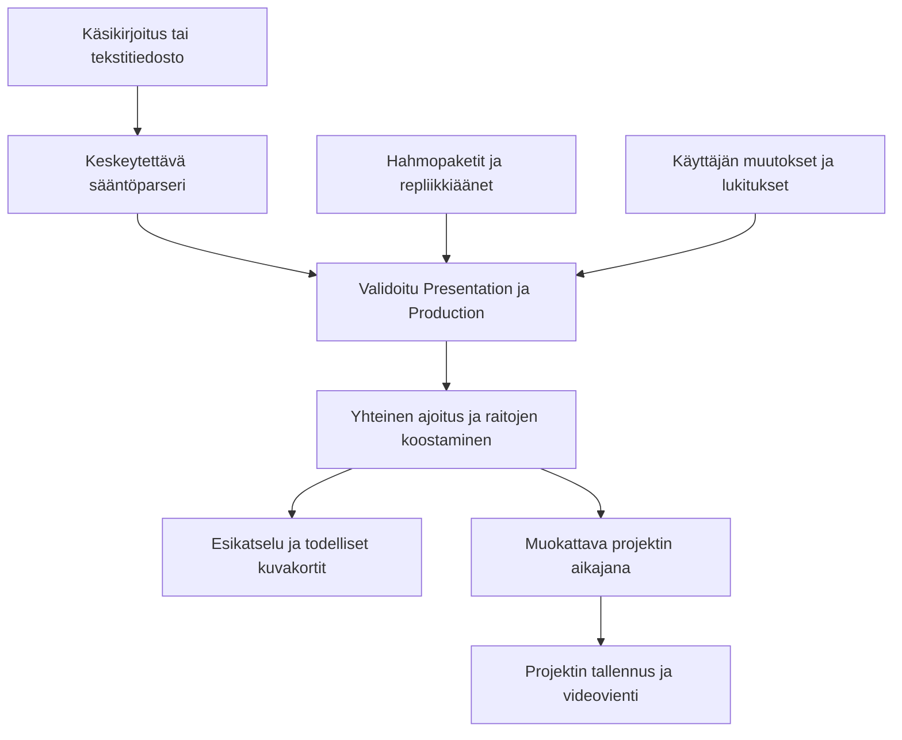

# Hahmostudio: käyttöliittymä, käyttökokemus, toiminnallisuudet ja logiikka

Dokumentoitu lähdekoodiversio: **0.10.0**, 4.10.2026. Tämä kuvaus käsittelee nykyistä toteutusta. Hahmostudio on edelleen kehitysvaiheessa; keskeneräiset ominaisuudet ja testauksen rajat on erotettu toteutetuista.

## 1. Sovelluksen tarkoitus

Hahmostudio on suomenkielinen, paikallisesti toimiva hahmoanimaation editori. Käyttäjä voi tuoda oman PSD- tai PNG-kuvan, käyttää valmista hahmopakettia, määrittää hahmon nivelet, animoida hahmoa ja rakentaa käsikirjoituksesta muokattavan dialogijakson. Kamera, mikrofoni, näppäimet, käsin tehdyt avainruudut ja käsikirjoitus tarjoavat eri tapoja ohjata samaa animaatiota.

Tavallinen käyttötavoite on 1080 × 1920 pystyvideo Instagramiin tai TikTokiin. Näyttämö voi olla myös 1920 × 1080 laajakuva tai 1080 × 1080 neliö. Sarjatyökalulla voi koota tallennettuja jaksoja laajakuvaesitykseksi. Sovellus ei julkaise videoita sosiaaliseen mediaan automaattisesti.

Verkkoversio ja Macin Electron-sovellus käyttävät samaa React/TypeScript-editoria, dokumenttimallia ja animaatiologiikkaa. Mac-versio lisää paikallisen tiedostonkäsittelyn, natiivin valikkorivin, puhetyökalujen ajamisen ja videovientijonon. PSD-, kamera- ja ääniaineistoja ei lähetetä pilveen tämän toteutuksen toimesta.

## 2. UI/UX: työtilan rakenne

### Yläpalkki ja valikot

Yläreunan **Tiedosto, Muokkaa, Näytä, Asetukset ja Ohje** kokoavat toiminnot. Keskeisille toiminnoille, kuten hahmokirjaston avaamiselle, tallentamiselle ja viennille, on myös suorat painikkeet. Mac-versiossa on lisäksi käyttöjärjestelmän valikkorivi.

- **Tiedosto:** projektin avaaminen, tallentaminen, tallentaminen nimellä ja aineistojen tuonti.
- **Muokkaa:** aiempaan toimintoon palaaminen ja sen tekeminen uudelleen; käytettävissä oleva historia riippuu muokattavasta kokonaisuudesta.
- **Näytä:** kirjaston, ominaisuuksien, aikajanan ja laitteiden tilarivin näkyvyys sekä näkymän palautus.
- **Asetukset:** käyttöliittymän ja käytettävissä olevien ohjausten asetukset.
- **Ohje:** suomenkieliset käyttö- ja nimeämisohjeet.

Valikot käyttävät tavallisia semanttisia painikkeita ja avautuvia ryhmiä. Escape sulkee valikon; nuolilla sekä Home/End-näppäimillä voi siirtyä valikon toimintoihin. Toiminto, jonka edellytykset puuttuvat, näkyy estettynä.

### Kolme työtilaa

| Työtila | Käyttäjän tehtävä | Keskeinen sisältö |
| --- | --- | --- |
| **Hahmo** | Valmistele piirros animoitavaksi | Tasot, nivelmääritys, osien liitokset ja piirtämistyökalut |
| **Esitys** | Ohjaa ja tallenna hahmon esitystä | Kamera, mikrofoni, näppäinohjaus ja esityksen tallennus |
| **Animointi** | Muokkaa ajoitusta ja viimeistele jakso | Avainruudut, liikkeet, ääni, käsikirjoitus ja vienti |

Työtilan vaihtaminen muuttaa saman editorin näkymää. Se ei luo erillistä projektia eikä itsessään korvaa animaatiota.

### Paneelit ja näyttämö

Vasen paneeli sisältää hahmo- ja taustakirjaston, käsikirjoituksen, hahmon osat sekä jaksot/sarjan. Keskellä on näyttämö ja sen esikatselu. Oikealla ovat valinnan, näyttämön ja liikkeiden ominaisuudet. Aikajana avautuu alareunaan.

Sivupaneelien leveyttä ja aikajanan korkeutta voi muuttaa vetämällä erotinta. Erotinta voi käyttää myös näppäimistöllä. Mitat tarkistetaan ja rajataan niin, että näyttämölle jää tilaa. Paneelien näkyvyys ja koot tallentuvat paikallisiin käyttöliittymäasetuksiin, eivät hahmon piirrokseen tai videon sisältöön. Pienellä näytöllä paneelit voivat pinoutua.

Paneelin piilottaminen säilyttää sen komponentit ja ohjausten tilan. **Kameran sulkeminen tehdään kameran omasta pysäytys-/pois-toiminnosta**, ei piilottamalla kameran paneelia. Kamera, mikrofoni ja näppäimet ovat itsenäisiä lähteitä. Tilarivi kertoo niiden tilan sekä tallennuksen tilan.

Näyttämön sovitus, lähennys ja loitonnus muuttavat editorin katselutapaa. Hahmon paikka/koko ja kameran rajaus puolestaan voivat muuttaa itse esitystä. Näitä ei pidä sekoittaa keskenään. Keskittäminen ja sommittelun apurajat auttavat sijoittelussa; apurajat eivät kuulu vietyyn videoon.

### Saavutettavuuden toteutukset

Syötteillä on nimilaput, työtiloilla ja valinnoilla valintatila, erottimilla näppäimistökäyttö ja tilaviestit näkyvät myös tekstinä. Vaalea, tumma ja järjestelmän ulkoasu ovat valittavissa. Kooditestit tarkistavat muun muassa valittujen tekstien ja tilojen kontrastia. Tämä ei tarkoita, että koko sovelluksen saavutettavuus olisi ulkopuolisesti auditoitu tai että kaikki laite-/selainyhdistelmät olisi testattu.

## 3. Hahmot, tasot ja nivelmääritys

### Kuvien tuonti ja muokkaus

PSD tuodaan erillisessä käsittelysäikeessä. Sovellus muodostaa normalisoidun dokumentin, jossa ovat tasojen tunnisteet, hierarkia, kuvat, näkyvyys, mitat ja dokumentin koordinaatit. Tasojen nimet voivat auttaa roolien tunnistamisessa, mutta nimi ei yksin muodosta niveltä tai liitosta. PNG-tuonti tuo kuvan; se ei tee kuvasta automaattisesti valmista nivellettyä hahmoa.

PSD-esikatselussa erotetaan alkuperäinen Photoshopin tallentama yhdistelmäkuva ja editorin tulkitsemat tasot. Tuonnin varoitukset ilmoittavat ominaisuudet, joita ei toisteta täydellisesti, kuten tuetun polun ulkopuoliset maskit, säädöt tai efektit. PSD-tuki ei vastaa Photoshopin koko tiedostomuotoa.

Piirtämistyökaluihin kuuluvat rasterisivellin, pyyhin, pipetti, alueen valinta ja siirto, palautettavat maskit sekä yksinkertainen vektorigeometria. Muokkaukset tallentuvat projektiin; alkuperäisiä tasotunnisteita ja nivelsidoksia säilytetään.

### Nivelten ja liitosten logiikka

Nivelmäärityksessä osalle annetaan rooli ja dokumentin koordinaateissa oleva kiertokeskus. Osa voi olla liitetty toiseen osaan `parentKey`-viittauksella. Liitosketju tarkistetaan: samaan ketjuun ei saa syntyä kehää.

Lapsen lopullinen muunnos yhdistää sen oman muunnoksen ja kaikkien esi-isien muunnokset. Näin esimerkiksi vartalon siirto liikuttaa siihen liitettyä päätä, ja pää liikuttaa siihen liitettyjä silmiä ja suuta. Piirtojärjestys ja näkyvyys säilyvät erillisinä asioina: osan liittäminen ei automaattisesti vaihda sen tasopaikkaa.

Pään irtoaminen vartalosta voi johtua puuttuvasta liitoksesta tai aiemmin tallennetusta siirtymästä. Pää liitetään vartaloon ja sen kiertokeskus sijoitetaan kaulaan. Uusi kameraseuranta rajoittaa liitetyn pään paikallista siirtymää ja kallistusta; vanhoja tallennettuja avainruutuja ei poisteta automaattisesti.

### Hahmokirjasto ja esitystavat

Kirjastossa ovat vanhat alkuperäiset hahmot ja lähde-PSD:t sekä Aino-/Otto-/Roni-/Salla-monikulmapaketit ja Studio-lisäykset. Valmis `.hahmo` voi sisältää kuvat, nivelet ja pikaanimoinnin roolisidokset. Monikulmainen 2D-hahmo käyttää erillisiä etu- ja profiilipiirroksia sekä kullekin kulmalle omia sidoksia.

Nykyiset kolme esitystapaa on erotettava:

| Esitystapa | Toteutus | Rajaus |
| --- | --- | --- |
| **2D** | Tasokuvat ja niihin kohdistuvat muunnokset | Kuvakulma vaatii siihen kuuluvan piirroksen |
| **Paperi/2.5D** | PSD-tasojen projektiot syvyysasetuksilla | Ei tilavuudellinen kehomalli |
| **Roni/Salla-toon 3D** | Tilavuusgeometria, luuranko ja nivelpainot | Mallit ovat `review`-tilassa, eivät taiteellisesti lopullisia |

3D-malli käyttää samoja hahmoprofiileja ja liike-/suuohjauksia esikatselussa ja viennissä. Ihon, hiusten, paidan, housujen ja kenkien värit tallentuvat hahmoprofiiliin. Mallit ovat kolmiulotteisia pintoja; niitä ei toteuteta yhtenä kuvana 3D-tasolla. Renderöinti on Canvasin CPU-kolmiorenderöintiä ortografisella kameralla ja toon-väreillä. Syvyysratkaisu perustuu kolmioiden järjestykseen, ei täydelliseen z-bufferiin. Vapaa mallinnuseditori, vaatteen fysiikka ja mielivaltaisten 3D-mallien tuonti puuttuvat.

## 4. Animaatio, kamera ja mikrofoni

### Aikajana ja liikkeet

Animaatio muodostuu osakohtaisista raidoista ja avainruuduista. Pose sisältää siirron X/Y, kierron, koon ja peittävyyden. Avainruutujen välissä käytetään lineaarista, pehmeää tai paikallaan pitävää interpolointia.

Valmiit liikkeet, kuten kävely, juoksu, vilkutus, hyppy, kyykistys ja nyökkäys, tuottavat muokattavia raitoja. Kävelyssä ja juoksussa suunta voi valita aktiivisen 2D-kuvakulman. Profiilikävely käyttää kahden nivelen IK-ratkaisua ja tukivaiheen jalkakohdetta. Etukävelyn 2D-perspektiivi on tyylitelty. Uuden liikkeen lisääminen pyrkii säilyttämään muun animaation ja puheen suuraidat.

### Live-ohjausten yhdistäminen

MediaPipe-kasvomalli antaa kamerasta pään, silmien, pupillien, kulmien ja suun ohjausta. Ohjaus tarvitsee hahmosta vastaavat roolisidokset. Kamera ei siis pysty sulkemaan puuttuvaa silmäluomitasoa tai näyttämään suumuotoa, jota hahmossa ei ole.

`mixPerformance` yhdistää aikajanan, pikaanimoinnin, kameran ja mikrofonin posesignaalit. Suun lähde voi olla automaattinen, kamera tai mikrofoni. Automaattisessa tilassa puheaktiivisuus antaa mikrofonille suun ohjauksen; hiljaisuudessa ohjaus palautuu kameralle. Tämä on ohjausten yhdistelyä, ei puhujan tai tunteen täydellistä tunnistusta.

### Ääninäyttely ja huulisynkronointi

Käyttäjä voi tallentaa oman repliikkinsä mikrofonilla tai tuoda äänitiedoston. Tallenne liitetään valittuun repliikkiin. Pidemmästä äänestä voi rajata repliikin alku- ja loppukohdan. Alkuperäinen ääni säilyy paikallisena resurssina; sen rajaaminen ja äänen vaihtaminen päivittävät riippuvan ajoituksen.

Suun liikuttamiseen on eri tasoisia menetelmiä:

- Äänen voimakkuuteen perustuva auki/kiinni-ohjaus on yksinkertainen lip sync.
- Paikallinen Rhubarb analysoi ääntä ja sovittaa vihjeet hahmon käytettävissä oleviin suumuotoihin. Dialogipolussa sovitus on rajattu kolmeen muotoon.
- Paikallinen Whisper-litterointi tunnistaa sanoja erilliseksi tarkistettavaksi tekstiksi. Se ei ole suumuotojen tunnistus eikä automaattisesti korvaa käsikirjoitusta.

Tekstipituuteen perustuva puhekesto on vain esikatselun arvio. Lopullinen dialogin ajoitus perustuu tuodun tai tallennetun äänen kestoon. Ohjelma ei nopeuta ääntä salaa tavoitepituuteen pääsemiseksi. Nykyiseen sovellukseen ei ole kytketty toimivaa käsikirjoituksesta puhetta tuottavaa TTS-palvelua.

## 5. Käsikirjoituksesta muokattavaksi jaksoksi

### Käyttäjän työnkulku

1. Liitä käsikirjoitus tai tuo UTF-8 `.txt`/`.md`.
2. Tunnista ja tarkista käsikirjoitus.
3. Yhdistä puhujat kirjaston tai omiin `.hahmo`-hahmoihin.
4. Tarkista kuvat, toiminta, katseet, ilmeet, miljööt ja ajoitus.
5. Tuo tai äänitä repliikkiäänet ja tarkista suun ajoitus.
6. Hyväksy tulkinta-arviot ja korjaa puuttuvat olennaiset resurssit.
7. Rakenna jakso nykyiseen projektiin, tallenna ja vie video.

Keskeneräinen valmistelu voidaan tallentaa ennen valmiin jakson rakentamista. KILSAT on regressio- ja käyttöönottoesimerkki; yleinen moottori ei perustu sen hahmonimiin tai repliikkeihin. Omien puheäänien tallentamista varten demogeneraattori tekee myös erillisen KILSAT-äänitysvalmistelun.

### Parseri ja ohjauspöytä

Suomen- ja englanninkielinen sääntöparseri tunnistaa tuettuja puhujia, repliikkejä, kohtausotsikoita, liikkeitä, ilmeitä, katseita, kuvakokoja, kuvakulmia, kameraliikkeitä ja taukoja. Alkuperäinen teksti säilyy. Repliikkejä ei käännetä, tiivistetä tai keksitä lisää.

Parseri toimii keskeytettävässä Workerissa. Käyttöliittymä näyttää käsittelyn etenemisen. Peruutetun tai vanhentuneen käsittelyajon tulos ei saa korvata uudempaa syötettä.

Semanttista paikallista kielimallia ei ole kytketty. Vapaamuotoinen proosa ja epäselvät ohjeet eivät siksi ole kattavasti ymmärrettyjä. Ohjaussuunnitelma erottaa toteutetun, arvion ja puuttuvan vaatimuksen; olennaisesti puuttuva toteutus estää valmiin jakson rakentamisen. Käsikirjoituksesta ei suoriteta JavaScriptiä tai käyttöjärjestelmän komentoja.

Ohjauspöydän näkymät:

| Näkymä | Sisältö |
| --- | --- |
| Käsikirjoitus | Valittavat tapahtumat, lähdeteksti ja yhteinen toistokohta |
| Kuvakortit | Todellisista asseteista ja ajankohdista renderöidyt kuvat |
| Reaktiot | Hiljaiset hetket, ilmeet ja erilliset lukitukset |
| Hahmot · 2D / 3D | Esitystapa ja hahmoprofiilin värit |
| Miljööt ja esineet | Paikallinen haku, taustat ja rekvisiitta |
| Sarjan ohjaus | Muistiot, kamera paikallaan -sääntö ja tallennetut kameravaihtoehdot |

Kuvan valitseminen siirtää esikatselun samaan tapahtumaan. Kameran rajauksen keskipistettä ja valitun katsetapahtuman kohdetta voi muuttaa napauttamalla esikatselua. Suora asentojen manipulointi esikatselussa ei vielä ole toteutettu.

### Yhteinen esitysmalli ja päivitykset

`Presentation` kokoaa alkuperäisen käsikirjoituksen, metatiedot, puhujat, hahmosidokset, näyttämön, tapahtumat, äänilinkit, suuohjauksen ja diagnostiikan. `Production` lisää käsikirjoitusrevision, tekstialueviitteet, kamerat, esitystavat, profiilit, generoidun pohjan, käyttäjän ohitukset ja lukitukset.

Käsikirjoituksen muuttuessa vanhoja ja uusia tapahtumia kohdistetaan sisältö- ja järjestysankkureilla. Säilytetty tapahtuma säilyttää tunnisteensa; uusi tapahtuma saa uuden tunnisteen. Käyttäjän muuttamat kamerakentät ja erikseen lisätyt odotukset säilytetään. Muuttuneen repliikin vanhaa ääntä ei jätetä automaattisesti uuden tekstin ääneksi. Lukitun tapahtuman poistuminen näkyy ristiriitana. Tämä kohdistus ei ole täydellinen semanttinen tekstivertailu.



### Ajoitus ja lukitukset

Puhe, kuvat ja liikkeet käyttävät yhteistä sekunteihin perustuvaa ajoitusta. Ruudut muodostetaan valitun kuvataajuuden mukaan. Puheen todellinen kesto voi siirtää sen jälkeen tulevaa reaktiota. Absoluuttisesti lukitun aloituksen mahdoton sijoitus ilmoitetaan ristiriitana.

Lukituksia on neljä: **sisältö, kesto, absoluuttinen alku ja suhteellinen rytmi**. Esimerkiksi 0,7 sekunnin hiljaisen reaktion keston lukitseminen ei tarkoita sen aloituksen lukitsemista tiettyyn kellonaikaan. Suojatussa pokerinaamassa ei lisätä satunnaisia eleitä tai räpäytyksiä. Puheen alkaessa suu voi silti liikkua.

Kuvakortin siirto käsittelee siihen liittyvää tapahtumaryhmää. Rikkoutuva riippuvuus, kohtausrajan ylitys tai absoluuttisen lukituksen muutos hylätään. Kuvan loppuun lisätty hiljainen odotus ei venytä puheääntä.

### Kameran ja näyttämön ero

Hahmojen paikat, liikkeet ja esineiden tila kuuluvat näyttämön maailmantilaan. Kamera määrää, mitä siitä näkyy. Hard cut vaihtaa kuvan nollaamatta hahmojen asentoa tai puhelimen omistajaa.

Kuvakoko (laaja/puoli/lähikuva), katselukulma (etu/viisto/sivu/taka), korkeus (silmä/ylä/ala) ja liike (paikallaan/zoom/pan/seuranta) ovat erillisiä kenttiä. 3D-kamerakulma edellyttää kyseisessä polussa hahmojen 3D-esityksiä. Vinon 3D-kuvan yhteydessä litteän taustan perspektiivirajoitus ilmoitetaan. Olkapään yli -kuva on rajattu ortografinen sommittelu, ei täydellinen vapaa 3D-kuvaamo.

## 6. Taustat, rekvisiitta ja puhelin

Kirjastossa on 32 paikallista vektoritaustaa ja 20 vektoriesinettä. Ympäristöihin kuuluvat muun muassa studiot, auton ja puhelinympäristön aiemmat kuvakulmat, toimisto, koti, kahvila, kirjasto, luokka, katu, puisto ja ranta. Yleisesineisiin kuuluvat esimerkiksi kirja, muki, laukku, näyttö, kannettava ja pöytä. Esineen paikka, koko ja näkyvyyden aikaväli ovat muokattavia.

Taustat ja yleisesineet ovat **2D-vektoreita**, eivät vapaasti kierrettäviä 3D-ympäristöjä. Omien ympäristöpakettien erillinen tuontieditori ja valoprofiilin muokkaus eivät vielä ole valmiita.

Puhelimella on erillinen kiinnityslogiikka. Se seuraa hahmon aktiivista kättä ja nivelsidoksia tai jää irrotuksen jälkeen näyttämölle. Toimintoihin kuuluvat pitäminen, katsominen, napautus, näyttäminen toiselle tai kameralle, nostaminen korvalle, laskeminen pöydälle ja siirtäminen toiseen käteen. Toiminnot tuottavat IK-avainruutuja. Pöydälle laskeminen edellyttää näkyvää pöytää käden ulottuvilla; muuten annetaan virhe. Puhelimen näytön vapaa sisältöeditori puuttuu.

## 7. Tallennus, yhteensopivuus ja vienti

`.hahmo` on validoitava projektiarkisto, joka voi sisältää tasokuvat, dokumentin, nivelet, animaation, näyttämön, käsikirjoitusvalmistelun, hahmoresurssit ja alkuperäiset äänet. Tuotantomallia käyttävä tiedosto on versiota 5. Nykyinen lukija hyväksyy versiot 1–5; vanha 0.9 ei osaa lukea v5:tä. Säilytä vanha projekti ja tallenna päivitys uudella nimellä. `.sarja` on erillinen sarjan/jaksojen tallennusmuoto.

Web-vienti käyttää selaimen omia mediaominaisuuksia. Macin vientijono käyttää jäädytettyjä projektitavuja, erillistä renderöinti-ikkunaa ja paikallista FFmpeg-prosessia. Vientimuotoihin kuuluvat MP4, GIF ja PNG-kuvasarja. Vienti tarkistaa kohteen ja rajat, kuittaa ruututallennukset ja viimeistelee tuloksen atomisesti. Peruutus vapauttaa työresurssit. VideoToolbox valitaan vasta onnistuneen todellisen kokeen jälkeen; OpenH264 on ilmoitettu ohjelmistovaihtoehto.

Näyttämön esikatselu, kuvakortit ja vienti käyttävät yhteisiä renderöintifunktioita. Sama malli on siten lähtökohta kaikille, vaikka eri vientipoluilla on erilaiset tekniset rajat.

## 8. Keskeiset tekniset rajat

| Kohde | Nykyinen raja tai ehto |
| --- | --- |
| PSD-tuonti | Enintään 100 MiB, 16 MP dokumentti, 48 MP dekoodattuja pikseleitä, 1 000 tasoa; ei PSB:tä |
| Käsikirjoitus | 60 000 merkkiä, enintään 4 hahmoa, 2 500 tapahtumaa ja 200 osiota |
| Repliikkiäänet | Enintään 1 000 klippiä; yksittäinen ääni 25 MiB |
| Projektiarkisto | Enintään 128 MiB; miksatun jaksoäänen importeriraja 116 MiB |
| Pitkä tuotantomalli ja Mac-vientipolku | Enintään 1 200 s / 72 000 ruutua; kuvataajuus ja muut rajat voivat pienentää käytännön kestoa |
| Mac-viennin työtila | Väliaikaiskuvat enintään 4 GiB ja ääni 100 MiB |
| Vanha web-MP4-polku | Enintään 60 s ja 128 MiB; riippuu selaimen mediaominaisuuksista |
| Animaation avainruudut | 10 000 avainruudun raja on edelleen huomioitava |

Yli tuhannen sanan suomen- ja englanninkielisiä käsikirjoituksia testataan oikeilla fixtureillä: 1 062 ja 1 489 sanaa. Tämä ei takaa kaiken vapaamuotoisen proosan ymmärtämistä eikä kaikkien pitkien jaksojen täyslaatuista vientiä yllä olevista rajoista riippumatta.

## 9. Paikallisuus, yksityisyys ja Macin rakenne

Yksityinen web-versio käyttää paikallista Node-palvelinta ja omistajan kirjautumista. GitHub Pages ei aja tätä palvelinta. GitHub-repositorion yksityisyys ja verkkosovelluksen kirjautuminen ovat eri asioita.

Electronin pääprosessi hallitsee käyttöjärjestelmän ikkunoita, tiedostodialogeja ja natiivityökaluja. Käyttöliittymälle tarjotaan rajattu preload-/IPC-silta; yleistä komentojen suorittamista tai Node-integraatiota rendererissä ei ole. Context isolation, sandbox ja web security säilyvät käytössä. Paikallinen palveluprosessi kuuntelee loopback-osoitteessa ja käyttää käynnistyskohtaista istuntoa. Desktop ei muokkaa verkkoversion omistajasalasanaa.

Projektit ja asetukset ovat sovelluspaketin ulkopuolella. Sulkemisessa huomioidaan tallentamaton työ ja tallennusvirheet. Mac-sovellus ei päivity automaattisesti lähdekoodin tai GitHubin päivityksestä: uusi sovellus on rakennettava/paketoitava ja vanha suljettava ennen sen korvaamista.

## 10. Lähdekoodin vastuut

| Tiedosto tai kokonaisuus | Vastuu |
| --- | --- |
| `components/editor.tsx` | Yhteinen editori, työtilat, projektitila ja toimintojen kytkentä |
| `components/app-menu.tsx`, `panel-resizer.tsx` | Valikkokäyttö ja paneelien mittojen muuttaminen |
| `lib/view-layout.ts`, paneelien asetukset | Näkyvyyden ja kokojen paikallinen käyttöliittymätila |
| `lib/psd-model.ts`, `psd-render.ts` ja PSD-worker | Dokumentin normalisointi, tuonti ja tasopiirtäminen |
| `lib/rig-model.ts`, `animation-transform.ts` | Nivelet, vanhempisuhteet ja ketjutetut muunnokset |
| `lib/animation-model.ts`, `inverse-kinematics.ts`, `locomotion.ts` | Avainruudut, interpolointi, IK ja kävely |
| `lib/performance-mixer.ts`, kamera-/mikrofonimoduulit | Live-ohjausten yhdistely |
| `components/presentation-panel.tsx`, `production-board.tsx` | Käsikirjoitustyötila, ohjauspöytä ja paikallinen muokkaushistoria |
| `lib/presentation-parser.ts`, `presentation-direction.ts` | Sääntötulkinta ja vaatimusten tarkistus |
| `lib/production-model.ts`, `production-job.ts`, `production-worker.ts` | Tuotantomalli, lähdeviitteet, päivitykset ja keskeytettävä käsittely |
| `lib/presentation-timing.ts`, `presentation-compile.ts` | Yhteinen ajoitus ja hahmokohtaisten raitojen koostaminen |
| `lib/presentation-stage.ts`, `presentation-render.ts` | Jatkuva maailmantila ja kamerasta riippuva kuva |
| `lib/toon3d.ts`, `toon-render.ts` | Tilavuusmallit, skinning ja 3D-toon-piirtäminen |
| `lib/phone-actions.ts`, `phone-prop.ts` | Puhelintoimintojen IK ja kiinnitys |
| `lib/environment-library.ts`, `prop-library.ts`, `backgrounds.ts` | Ympäristö- ja esinerekisterit sekä piirtäminen |
| `lib/presentation-audio.ts`, `phonetic-speech.ts` | Repliikkiäänen käsittely, miksaus ja suumuodot |
| `lib/project-file.ts`, `scene-model.ts` | Arkiston ja näyttämön validointi sekä yhteensopivuus |
| `lib/export-render.ts`, `export-presets.ts` | Yhteinen vientipiirtäminen ja vientiasetukset |
| `desktop/export-queue.mjs`, `export-service.mjs`, `encoder.mjs` | Mac-vientijono, ruutujen käsittely ja FFmpeg |
| `desktop/main.mjs`, `preload.cjs`, `files.mjs` | Mac-ikkuna, rajattu silta ja turvallinen tiedostonkäsittely |
| `server/private-server.mjs`, `speech-recognizer.mjs`, `transcriber.mjs` | Paikallinen palvelin, Rhubarb ja Whisper |

## 11. Testaus ja keskeneräinen työ

0.10-kehitysversion tarkistuksessa **160 kooditestiä läpäisi**. TypeScript, yksityisen web-version rakennus, Mac-paketointi ja paketoidun sovelluksen Node-runtime-tarkistus läpäisivät. 18 sekunnin todellinen 3D-liiketarkistus tuotti 432 ruutua ja 1920 × 1080 / 24 fps H.264-videon ilman ääntä. Kuvakortteja, kameravalintaa/kumoamista ja kirjastohakua kokeiltiin käyttöliittymässä.

Testit eivät vahvista fyysisen mikrofonin/kameran, Safarin tai Macin graafisen käynnistyksen toimintaa kaikissa ympäristöissä. Aiempi GUI-koe tässä suoritusympäristössä päättyi exit 134; onnistunut Node-runtime-tarkistus ei korvaa GUI-koetta.

Keskeneräistä ovat muun muassa semanttinen proosatulkinta, kaikkien ohjeiden vaikutusalueet ja pronominit, suora asentojen manipulointi esikatselussa, laajempi sarjaprofiilien resurssienhallinta, omien ympäristöpakettien tuonti, valoprofiilin editori, vapaat 3D-miljööt, 3D-hahmojen lopullinen taiteellinen viimeistely ja puhelimen näytön sisältöeditori.

71,5 sekunnin demovalmistelu säilyttää KILSATin 18 alkuperäistä repliikkiä. Se on tekstiajoitettu valmistelu, ei valmis äänellinen esittelyvideo. Käyttäjä on valinnut repliikkien tallentamisen omalla äänellään; lisäksi lopullinen demo tarvitsee oikean käyttöliittymätallenteen.

## 12. Kehittäminen ja muut dokumentit

```sh
npm ci
npm run typecheck
npm test
npm run dev
npm run build:private
npm run start:private
npm run desktop:build
npm run desktop:package:mac
npm run desktop:test:package
```

Mac-paketointi edellyttää Macia ja valmisteltuja natiiviresursseja; yllä olevat komennot eivät tarkoita, että kaikki paketointiriippuvuudet syntyvät automaattisesti `npm ci`:llä.

- [README: käyttöönotto ja versiohistoria](README.md)
- [0.10: toteutus, rajat ja jatkotyö](DEVELOPMENT-0.10.md)
- [0.9: piirto-, litterointi- ja vientipolut](DEVELOPMENT-0.9.md)
- [Tekninen arkkitehtuuri ja aiempien versioiden ratkaisut](docs/ARCHITECTURE.md)
- [Dialogi ja repliikkiäänet](docs/DIALOGUE.md)
- [Yleinen jaksotyökalu](docs/EPISODE.md)
- [Mac-version ohje](docs/MAC_DESKTOP.md)
- [Jatkokehityksen suunnitelma](docs/ROADMAP.md)
- [Kolmansien osapuolten ilmoitukset](THIRD_PARTY_NOTICES.md)
