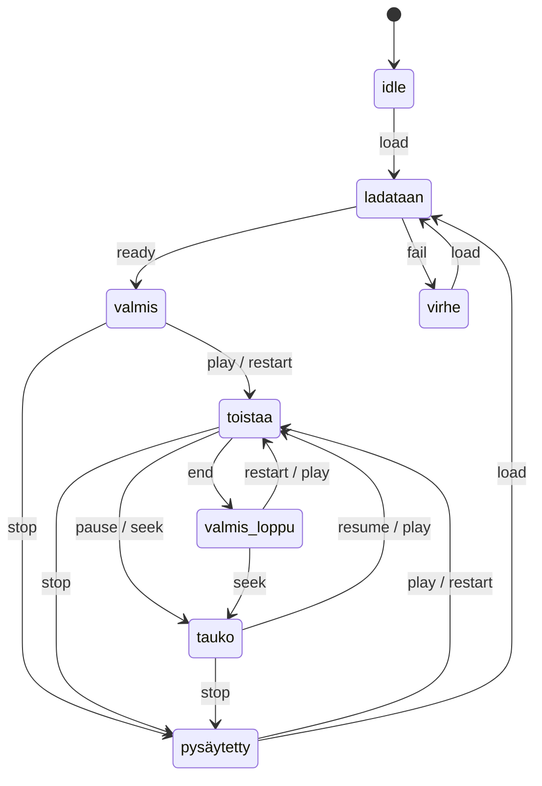

# Automaattinen kohtaus- ja toistotilakone

`lib/playback-machine.ts:allowed` on sallittujen siirtymien auktoritatiivinen taulukko;
80 testiä kattaa jokaisen tila–komento-parin, myös kielletyt. Parametreiltaan
virheellinen seek ei julkaise uutta tilaa. Kellonaika muunnetaan murtoruuduiksi,
ei lasketa yhtä animaatioruutua per requestAnimationFrame-kutsu.

Toisto etenee samassa projektiaikakoordinaatissa kohtausrajasta seuraavaan ja
päättyy viimeiseen ruutuun. Tauko säilyttää paikan; pysäytys palauttaa alkuun;
uudelleen alusta käynnistää alusta. Kohtausvalinta hakee tallennetun esityksen
section-alkuun. Muutokset animaation revisioon keskeyttävät käynnissä olevan
previewn. React-julkaisun viive ei määrää sisällön etenemisnopeutta.

Editorissa nykyiset avaamisen/virheen indikaattorit säilyvät. Toistopalkki näyttää
transportin valmis/toistaa/tauko/pysäytetty/valmis_loppu-tilat. Domain-controller
sisältää myös lataus- ja virhesiirtymät. Tämä ei ole SVG-liikelogiikkakaavion
blend-tree-runtime: niiden tarkoitukset ovat erilliset.

FPS-raportti syntyy todellisista editorin rAF-väleistä ja on tallennettavissa JSONina.
Se ei mittaa GPU:n näyttämien kuvien määrää eikä lupaa 60 fps kaikilla aineistoilla.
Alle 55 fps näkyy ilmoituksena. Synteettinen 60 Hz -testi varmentaa laskennan,
ei todellisen Macin suorituskykyä.
